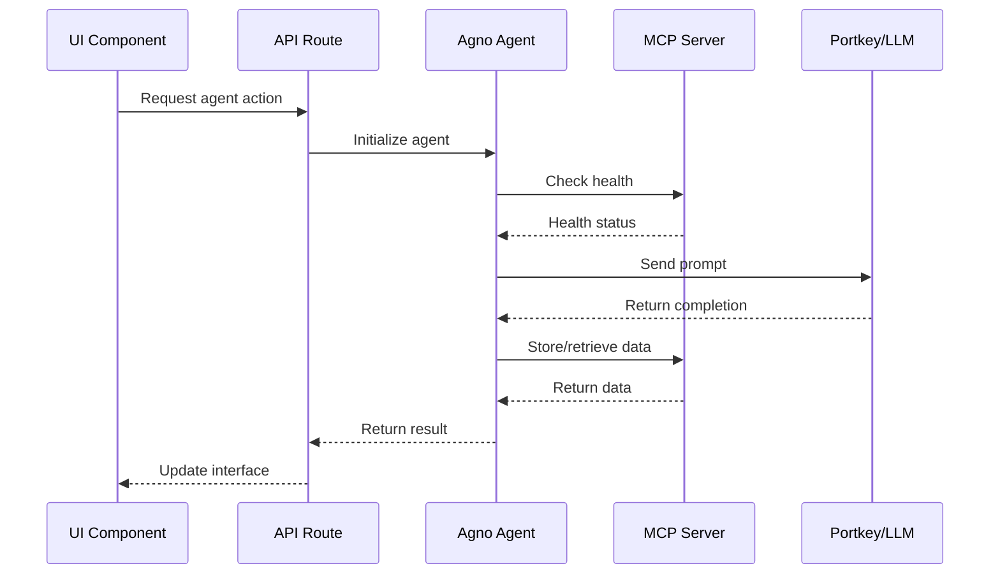

# Workbench UI Architecture

## System Overview

The Workbench UI is a Next.js 14 application that provides a comprehensive interface for managing and monitoring the Agno AI agent system.

## Component Architecture

```mermaid
graph TB
    subgraph Client Side
        A[Next.js App Router] --> B[Pages]
        B --> B1[Home Dashboard]
        B --> B2[Agents Management]
        B --> B3[Workflows]
        B --> B4[Settings]
        
        A --> C[Components]
        C --> C1[Agent Cards]
        C --> C2[MCP Status Monitor]
        C --> C3[Chat Interface]
        C --> C4[Workflow Builder]
        C --> C5[Log Viewer]
        
        A --> D[State Management]
        D --> D1[Zustand Stores]
        D --> D2[React Query Cache]
    end
    
    subgraph API Layer
        E[API Routes] --> E1[/api/agents]
        E --> E2[/api/mcp]
        E --> E3[/api/workflows]
        E --> E4[/api/websocket]
    end
    
    subgraph Backend Integration
        F[Agno Framework] --> F1[WorkspaceAgent]
        F --> F2[MCPClientPool]
        F --> F3[PortkeyProvider]
        
        G[MCP Servers] --> G1[Memory :8081]
        G --> G2[Filesystem :8082]
        G --> G3[Git :8084]
        G --> G4[Vector :8085]
    end
    
    E1 --> F1
    E2 --> F2
    F2 --> G
    F1 --> F3
```

## Data Flow



## Folder Structure

```
src/
├── app/                    # Next.js App Router
│   ├── layout.tsx         # Root layout with providers
│   ├── page.tsx           # Home dashboard
│   ├── agents/            # Agent management pages
│   │   ├── page.tsx       # Agent list
│   │   └── [id]/          # Agent detail pages
│   ├── workflows/         # Workflow pages
│   ├── settings/          # Settings pages
│   └── api/               # API routes
│       ├── agents/        # Agent operations
│       ├── mcp/           # MCP operations
│       └── workflows/     # Workflow operations
├── components/            # React components
│   ├── agents/           # Agent-related components
│   ├── workflows/        # Workflow components
│   ├── common/           # Shared components
│   └── ui/               # UI primitives
├── hooks/                # Custom React hooks
├── lib/                  # Core libraries
│   ├── agents/          # Agent utilities
│   ├── mcp/             # MCP utilities
│   └── utils/           # General utilities
├── stores/              # Zustand stores
│   ├── agent-store.ts   # Agent state
│   ├── workflow-store.ts # Workflow state
│   └── ui-store.ts      # UI state
└── types/               # TypeScript definitions
```

## Key Features

### 1. Agent Management
- List all configured agents (Architect, Coder, Reviewer, Tester)
- Start/stop individual agents
- View agent status and metrics
- Configure agent parameters

### 2. MCP Server Monitoring
- Real-time health status for all MCP servers
- Connection pool statistics
- Error logs and retry attempts
- Manual health check triggers

### 3. Workflow Execution
- Visual workflow builder
- Pre-configured workflows (feature_development, bug_fix, refactoring)
- Step-by-step execution monitoring
- Workflow history and results

### 4. Real-time Updates
- WebSocket/SSE for live agent status
- Push notifications for important events
- Live log streaming
- Progress indicators for long-running tasks

### 5. Developer Tools
- Agent chat interface for testing
- API playground for manual requests
- Performance metrics dashboard
- Debug mode with verbose logging

## Technology Stack

- **Framework**: Next.js 14 with App Router
- **Language**: TypeScript with strict mode
- **Styling**: Tailwind CSS + Radix UI Themes
- **State**: Zustand + React Query
- **API**: Fastify server for enhanced performance
- **Real-time**: WebSockets/Server-Sent Events
- **Validation**: Zod schemas
- **Icons**: Lucide React
- **Notifications**: React Hot Toast

## Security Considerations

- API key validation for all routes
- Rate limiting on API endpoints
- CORS configuration for MCP servers
- Environment variable protection
- Secure WebSocket connections