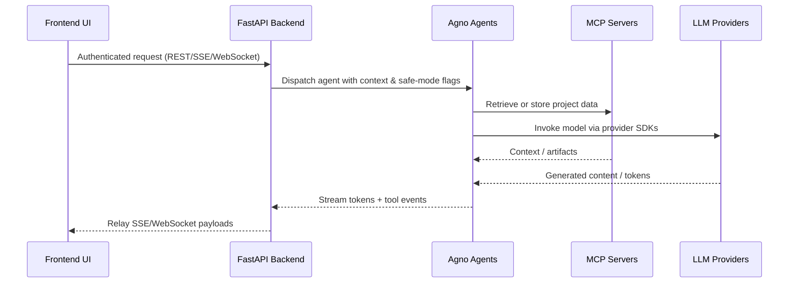

# Workbench UI Architecture

## System Overview

Workbench UI is a two-tier system that exposes Sophia Intel AI capabilities:

- **Frontend** – a Next.js 14 (App Router) application that renders the dashboard, agent console, and health views.
- **Backend** – a FastAPI service that authenticates the operator, brokers agent requests, proxies MCP traffic, and streams responses back to the UI.
- **MCP & Agents** – external Model Context Protocol servers and Agno agents that execute the requested work. They are orchestrated by the backend and surfaced to the UI.

The frontend and backend communicate over HTTPS with JWT authentication. Both services are packaged for Fly.io and can be deployed independently.

## Frontend (Next.js)

```
src/
├── app/                  # App Router routes (dashboard, agents, workflows, health)
│   ├── layout.tsx        # Global providers (theme, query client, auth)
│   ├── page.tsx          # Landing dashboard
│   ├── agents/           # Streaming agent console + workflow runner
│   └── api/              # Route handlers for lightweight UI helpers
├── components/           # Presentational + interactive React components
├── core/                 # Frontend configuration (theme, constants, feature flags)
├── lib/                  # API clients (REST + SSE), auth helpers, MCP utilities
└── types/                # Shared TypeScript contracts
```

Key behaviours:

- Uses `fetch`/SSE clients in `src/lib` to talk to the FastAPI backend.
- Renders live agent output with server-sent events and WebSocket heartbeats.
- Persists operator preferences with local storage helpers in `src/core`.
- Relies on environment variables exposed as `NEXT_PUBLIC_*` for backend URL and feature toggles.

## Backend (FastAPI)

The backend now follows a modular layout for clarity and testability:

```
backend/app/
├── api/                  # Route modules grouped by capability
│   ├── auth.py           # /auth/login
│   ├── health.py         # /health + health helpers
│   ├── agent.py          # /agent/execute streaming endpoint
│   ├── workflows.py      # /agent/workflow/* streaming + list
│   ├── deploy.py         # /deploy orchestrator
│   ├── command.py        # /command repository operations
│   ├── mcp.py            # /mcp/{service}/{path} proxy
│   ├── websocket.py      # /ws heartbeat channel
│   └── graphql.py        # /graphql schema + router
├── core/                 # Shared configuration and utilities
│   ├── config.py         # Environment parsing, Fly/MCP defaults, settings loader
│   ├── pii.py            # Data masking helpers
│   └── workflows.py      # Agno workflow loader + summaries
├── security/             # Authentication helpers
│   └── auth.py           # JWT issuance + dependency injection
├── agents/               # Existing agent implementations
└── main.py               # FastAPI application factory & middleware
```

Notable behaviours:

- **Authentication** – single admin user, JWT-based. `security/auth.py` validates credentials and enforces production secret requirements.
- **Streaming** – SSE responses for agent execution and workflow progress; WebSocket heartbeats for dashboard tiles.
- **MCP proxying** – restricted list of service endpoints with optional allowlists to mitigate SSRF.
- **Configuration** – `core/config.py` reads `config/sophia.config.yaml` for governance flags (PII masking, safe mode) and exposes Fly deployment defaults.

## Data Flow



## Deployment Topology

- **Frontend** – `fly.toml` + `Dockerfile.frontend` package the Next.js app. Deploy with `fly deploy --config fly.toml`.
- **Backend** – `backend/fly.toml` builds the FastAPI service from `backend/Dockerfile`. Deploy with `fly deploy --config backend/fly.toml` from the repo root.
- **Secrets** – Store operator credentials and API keys with `fly secrets` or environment managers. Local development uses `.env.local` and generated `.roo/mcp.json`.

## Documentation Map

- **This document** – Authoritative source for current architecture.
- **Backend/README.md** – Operational runbook, API usage, Fly deployment details.
- **Docs archive** – Historical documents (`docs/archive/SOPHIA_SYSTEM_ARCHITECTURE.md`, `docs/archive/SOPHIA_IMPLEMENTATION_SPECIFICATION.md`) retained for context.

Future changes to architecture should update this file first and reference any supplementary diagrams or ADRs from here.
