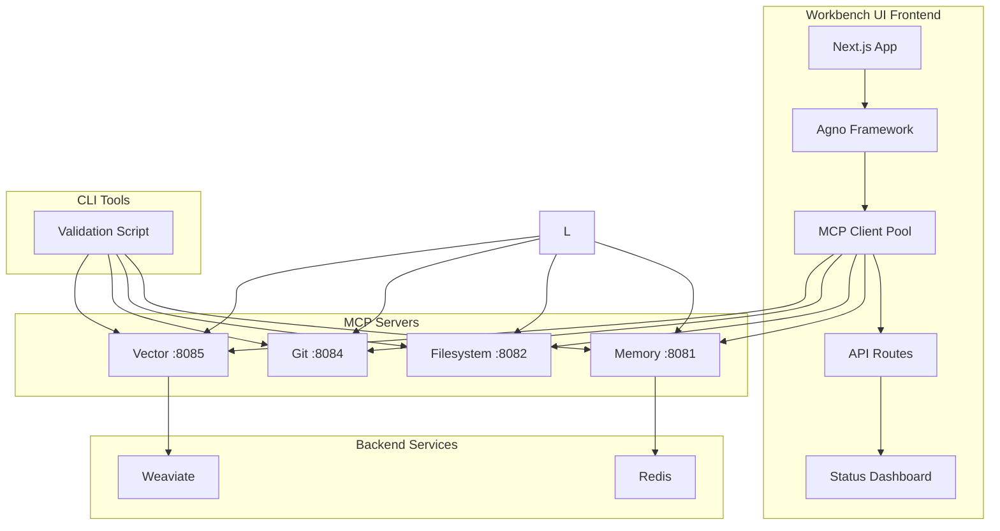

# Four-MCP Server Integration Implementation Plan

## Executive Summary
Complete integration and validation of four MCP servers (Memory, Filesystem, Git, Vector) across sophia-intel-ai backend and workbench-ui frontend repositories, with enhanced CLI capabilities and comprehensive testing.

## Architecture Overview



## Phase 1: Backend Infrastructure (sophia-intel-ai)

### 1.1 Vector Server Integration

**File: `/Users/lynnmusil/sophia-intel-ai/startup.sh`**
```bash
# Add Vector Server startup (after line 96)
# Start Vector Server
if ! curl -s http://localhost:8085/health >/dev/null 2>&1; then
    echo "   Starting Vector Server..."
    if [ -z "$WEAVIATE_URL" ]; then
        echo "   Warning: WEAVIATE_URL not set, Vector server may have limited functionality"
    fi
    nohup python3 -m uvicorn mcp.vector.server:app \
        --host 0.0.0.0 --port 8085 \
        > logs/mcp-vector.log 2>&1 &
    echo $! > .pids/mcp-vector.pid
    sleep 2
fi
echo -e "   ${GREEN}✅ Vector Server on 8085${NC}"
```

### 1.2 Validation Script Enhancement

**File: `/Users/lynnmusil/sophia-intel-ai/scripts/validate_mcp_servers.py`**

Add Vector server configuration:
```python
# Add to MCP_SERVERS dictionary (after Git, before closing brace)
"Vector": {
    "port": 8085,
    "health": "/health",
    "endpoints": [
        {
            "name": "Index Content",
            "method": "POST",
            "path": "/index",
            "data": {
                "content": "Validation test content for vector indexing",
                "metadata": {"source": "validator", "type": "test"}
            },
            "description": "Index content for vector search"
        },
        {
            "name": "Vector Search",
            "method": "POST",
            "path": "/search",
            "data": {"query": "validation", "limit": 5},
            "description": "Search indexed content"
        }
    ]
}
```

Add command-line flag for Vector skip:
```python
# In main() function, add argument
parser.add_argument("--allow-vector-skip", action="store_true", 
                    help="Skip Vector validation if Weaviate unavailable")
```

### 1.3 Shared Environment Configuration

**File: `/Users/lynnmusil/sophia-intel-ai/environments/shared-mcp.env`**
```bash
# MCP Server Configuration
MCP_MEMORY_URL=http://localhost:8081
MCP_FILESYSTEM_URL=http://localhost:8082
MCP_GIT_URL=http://localhost:8084
MCP_VECTOR_URL=http://localhost:8085

# Authentication (Dev Mode)
MCP_TOKEN=dev-token
MCP_DEV_BYPASS=1

# Backend Services
WEAVIATE_URL=http://localhost:8080
REDIS_URL=redis://localhost:6379

# Workspace Configuration
WORKSPACE_PATH=/Users/lynnmusil/sophia-intel-ai
```

### 1.4 Vector Server Path Enhancement

**File: `/Users/lynnmusil/sophia-intel-ai/mcp/vector/server.py`**

Enhance /index endpoint to handle path-only requests:
```python
@app.post("/index")
async def index_content(req: IndexRequest):
    """Index content with optional path-based file reading."""
    content = req.content
    
    # If path provided but no content, read from file
    if req.path and not content:
        file_path = Path(WORKSPACE_PATH) / req.path
        if not file_path.exists():
            raise HTTPException(400, f"File not found: {req.path}")
        if not file_path.is_file():
            raise HTTPException(400, f"Not a file: {req.path}")
        try:
            content = file_path.read_text(encoding='utf-8')
        except Exception as e:
            raise HTTPException(400, f"Cannot read file: {str(e)}")
    
    if not content:
        raise HTTPException(400, "No content provided")
    
    # Continue with existing indexing logic...
```

## Phase 2: Workbench UI Integration

### 2.1 Update MCP Client Configuration

**File: `workbench-ui/.cline/mcp_settings.json`**
```json
{
  "sophia-vector": {
    "type": "http",
    "url": "http://localhost:8085",
    "headers": {
      "Authorization": "Bearer dev-token",
      "Content-Type": "application/json"
    },
    "description": "Vector search and semantic indexing",
    "capabilities": [
      "vector.index",
      "vector.search",
      "semantic.similarity"
    ]
  }
}
```

### 2.2 Update Agno MCP Client

**File: `workbench-ui/agno/providers/mcp-client.ts`**
```typescript
// Add to MCP_SERVERS
vector: {
  name: 'Vector Server',
  url: 'http://localhost',
  port: 8085,
  protocol: 'http',
  healthCheckEndpoint: '/health',
  healthCheckInterval: 30000,
  timeout: 30000,
  maxRetries: 3
}

// Add Vector operations
async vectorIndex(content: string, metadata?: any): Promise<void> {
  await this.execute('vector', 'POST', '/index', { content, metadata });
}

async vectorSearch(query: string, limit: number = 10): Promise<any[]> {
  return this.execute('vector', 'POST', '/search', { query, limit });
}
```

### 2.3 Create API Routes

**File: `workbench-ui/src/app/api/mcp/health/route.ts`**
```typescript
import { NextResponse } from 'next/server';
import { mcpClientPool } from '@/agno/providers/mcp-client';

export async function GET() {
  const health = mcpClientPool.getHealthStatus();
  return NextResponse.json({
    status: 'ok',
    servers: health,
    timestamp: new Date().toISOString()
  });
}
```

**File: `workbench-ui/src/app/api/mcp/test/route.ts`**
```typescript
import { NextResponse } from 'next/server';

const MCP_SERVERS = [
  { name: 'memory', port: 8081 },
  { name: 'filesystem', port: 8082 },
  { name: 'git', port: 8084 },
  { name: 'vector', port: 8085 }
];

export async function POST() {
  const results = [];
  
  for (const server of MCP_SERVERS) {
    try {
      const response = await fetch(`http://localhost:${server.port}/health`, {
        headers: { 'Authorization': 'Bearer dev-token' }
      });
      const data = await response.json();
      results.push({
        server: server.name,
        port: server.port,
        status: data.status,
        healthy: response.ok
      });
    } catch (error) {
      results.push({
        server: server.name,
        port: server.port,
        status: 'error',
        healthy: false,
        error: error.message
      });
    }
  }
  
  return NextResponse.json({ results });
}
```

### 2.4 MCP Status Dashboard Component

**File: `workbench-ui/src/components/mcp-status-dashboard.tsx`**
```typescript
'use client';

import { useQuery } from '@tanstack/react-query';
import { Card, CardHeader, CardContent } from '@/components/ui/card';

interface ServerStatus {
  server: string;
  port: number;
  status: string;
  healthy: boolean;
}

export function MCPStatusDashboard() {
  const { data, isLoading, error } = useQuery({
    queryKey: ['mcp-health'],
    queryFn: async () => {
      const response = await fetch('/api/mcp/health');
      return response.json();
    },
    refetchInterval: 5000 // Poll every 5 seconds
  });

  if (isLoading) return <div>Loading MCP status...</div>;
  if (error) return <div>Error loading status</div>;

  return (
    <div className="grid grid-cols-2 gap-4">
      {Object.entries(data.servers).map(([name, status]) => (
        <Card key={name}>
          <CardHeader>
            <h3 className="text-lg font-semibold">{name}</h3>
          </CardHeader>
          <CardContent>
            <div className={`status-indicator ${status ? 'status-indicator-active' : 'status-indicator-inactive'}`} />
            <span>{status ? 'Healthy' : 'Offline'}</span>
          </CardContent>
        </Card>
      ))}
    </div>
  );
}
```

## Phase 3: CLI Enhancements

### 3.1 Add Status Command

 
```python
@cli.command()
@click.option('-v', '--verbose', is_flag=True, help='Verbose output')
def status(verbose):
    """Check MCP server health status."""
    import requests
    from rich.table import Table
    from rich.console import Console
    
    console = Console()
    table = Table(title="MCP Server Status")
    table.add_column("Server", style="cyan")
    table.add_column("Port", style="yellow")
    table.add_column("Status", style="green")
    
    servers = [
        ("Memory", 8081),
        ("Filesystem", 8082),
        ("Git", 8084),
        ("Vector", 8085)
    ]
    
    for name, port in servers:
        try:
            response = requests.get(
                f"http://localhost:{port}/health",
                headers={"Authorization": "Bearer dev-token"},
                timeout=2
            )
            if response.ok:
                data = response.json()
                status = f"✅ {data.get('status', 'OK')}"
            else:
                status = f"⚠️ HTTP {response.status_code}"
        except requests.exceptions.ConnectionError:
            status = "❌ Offline"
        except Exception as e:
            status = f"❌ Error: {str(e)[:20]}"
        
        table.add_row(name, str(port), status)
        
        if verbose and response.ok:
            console.print(f"  {name}: {response.json()}")
    
    console.print(table)
```

### 3.2 Add Validate Command

```python
@cli.command()
@click.option('-o', '--output', help='Output file for report')
def validate(output):
    """Run MCP validation tests."""
    import subprocess
    
    cmd = ["python3", "scripts/validate_mcp_servers.py"]
    if output:
        cmd.extend(["-o", output])
    
    result = subprocess.run(cmd, capture_output=True, text=True)
    click.echo(result.stdout)
    if result.returncode != 0:
        click.echo(result.stderr, err=True)
        raise click.Abort()
```

## Phase 4: Testing Strategy

### 4.1 Backend Tests

**File: `/Users/lynnmusil/sophia-intel-ai/tests/test_mcp_servers.py`**
```python
import pytest
import requests
from unittest.mock import patch

class TestMCPServers:
    
    def test_memory_search_json_body(self):
        """Test Memory server accepts JSON body for search."""
        response = requests.post(
            "http://localhost:8081/search",
            json={"query": "test"},
            headers={"Authorization": "Bearer dev-token"}
        )
        assert response.status_code != 422
    
    def test_filesystem_time_bounded(self):
        """Test Filesystem operations complete within time budget."""
        import time
        start = time.time()
        response = requests.post(
            "http://localhost:8082/symbols/index",
            json={"languages": ["python"]},
            headers={"Authorization": "Bearer dev-token"},
            timeout=10
        )
        elapsed = time.time() - start
        assert elapsed < 10
        assert response.ok
    
    def test_vector_health_without_weaviate(self):
        """Test Vector health when Weaviate is unavailable."""
        with patch.dict('os.environ', {'WEAVIATE_URL': ''}):
            response = requests.get(
                "http://localhost:8085/health",
                headers={"Authorization": "Bearer dev-token"}
            )
            data = response.json()
            assert data['status'] in ['unhealthy', 'degraded']
```

### 4.2 Workbench UI Integration Tests

**File: `workbench-ui/scripts/test-mcp-integration.ts`**
```typescript
#!/usr/bin/env tsx

async function testMCPIntegration() {
  const servers = [
    { name: 'Memory', port: 8081, test: '/search', method: 'POST', body: { query: 'test' } },
    { name: 'Filesystem', port: 8082, test: '/fs/list', method: 'POST', body: { path: '.' } },
    { name: 'Git', port: 8084, test: '/status', method: 'GET' },
    { name: 'Vector', port: 8085, test: '/health', method: 'GET' }
  ];
  
  console.log('🧪 Testing MCP Server Integration...\n');
  
  for (const server of servers) {
    console.log(`Testing ${server.name} (port ${server.port})...`);
    
    try {
      const response = await fetch(`http://localhost:${server.port}${server.test}`, {
        method: server.method,
        headers: {
          'Authorization': 'Bearer dev-token',
          'Content-Type': 'application/json'
        },
        body: server.body ? JSON.stringify(server.body) : undefined
      });
      
      if (response.ok) {
        console.log(`  ✅ ${server.name}: OK`);
      } else {
        console.log(`  ⚠️ ${server.name}: HTTP ${response.status}`);
      }
    } catch (error) {
      console.log(`  ❌ ${server.name}: ${error.message}`);
    }
  }
}

testMCPIntegration();
```

## Phase 5: Unified Test Script

**File: `workbench-ui/scripts/test-full-system.sh`**
```bash
#!/bin/bash

echo "🔍 Full System Integration Test"
echo "================================"

# Check backend MCP servers
echo -e "\n1. Backend MCP Servers:"
cd /Users/lynnmusil/sophia-intel-ai
python3 scripts/validate_mcp_servers.py --quick

 

# Test Workbench UI integration
echo -e "\n3. Workbench UI MCP Integration:"
cd /Users/lynnmusil/workbench-ui
npm run test:mcp

# Test API routes
echo -e "\n4. API Route Tests:"
curl -s http://localhost:3201/api/mcp/health | jq '.'

echo -e "\n✅ Full system test complete!"
```

## Development Runbook

### Local Development Setup

1. **Start Backend Services:**
```bash
cd ~/sophia-intel-ai
source environments/shared-mcp.env
./startup.sh
```

2. **Verify All Servers:**
```bash
python3 scripts/validate_mcp_servers.py -v -o validation.json
```

3. **Start Workbench UI:**
```bash
cd ~/workbench-ui
source ../sophia-intel-ai/environments/shared-mcp.env
npm run dev
```

4. **Test CLI:**
```bash
cd ~/sophia-intel-ai
 
```

### Production Deployment

1. **Set Production Environment:**
```bash
export MCP_DEV_BYPASS=0
export MCP_TOKEN=<production-token>
```

2. **Start with Production Config:**
```bash
./startup.sh --production
```

3. **Run Health Checks:**
```bash
./scripts/test-full-system.sh
```

## Quality Control Checklist

- [ ] All 4 MCP servers start successfully
- [ ] Health endpoints return correct status
- [ ] Authentication works in dev and prod modes
- [ ] Vector server handles missing Weaviate gracefully
- [ ] CLI status command shows all servers
- [ ] Workbench UI connects to all servers
- [ ] API routes return expected data
- [ ] Integration tests pass
- [ ] Time-bounded operations complete within limits
- [ ] Retry logic handles transient failures
- [ ] No hardcoded secrets in code
- [ ] Documentation is complete and accurate

## Implementation Order

1. **Day 1:** Backend infrastructure (startup.sh, validator, environment)
2. **Day 2:** Workbench UI integration (config, API routes, client updates)
3. **Day 3:** CLI enhancements (status, validate commands)
4. **Day 4:** Testing and validation (unit tests, integration tests)
5. **Day 5:** Documentation and production readiness

## Success Metrics

- All 4 MCP servers operational with >99% uptime
- Validation script reports 100% pass rate
- CLI status command response time <2 seconds
- Workbench UI dashboard updates in real-time
- Zero authentication failures in production
- Complete test coverage for new code
