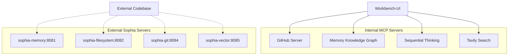

# MCP Servers Comprehensive Guide

## Table of Contents
1. [Architecture Overview](#architecture-overview)
2. [Internal MCP Servers](#internal-mcp-servers)
3. [Memory (Knowledge Graph) Server - Deep Analysis](#memory-knowledge-graph-server---deep-analysis)
4. [Server Configuration](#server-configuration)
5. [Usage Examples](#usage-examples)
6. [Best Practices](#best-practices)
7. [Testing and Validation](#testing-and-validation)

---

## Architecture Overview

The workbench-ui project uses a dual-configuration approach for MCP servers:

- **Internal Servers** (`.roo/mcp.json`): Core MCP servers for the workbench-ui project
- **External Servers** (`.cline/mcp_settings.json`): Sophia servers for viewing external codebases



---

## Internal MCP Servers

### 1. GitHub Server
**Type**: Docker-based  
**Purpose**: Full GitHub API integration

**Capabilities**:
- Repository management (create, fork, delete)
- Issues and PR management
- Code search and file operations
- Workflow and action management
- Gist operations
- Security advisory access

**Key Tools**:
- `get_me`: Get authenticated user details
- `create_issue`: Create new issues
- `create_pull_request`: Create PRs
- `search_code`: Search across repositories
- `get_file_contents`: Read repository files

### 2. Memory (Knowledge Graph) Server
**Type**: NPM-based (@modelcontextprotocol/server-memory)  
**Purpose**: Persistent context and knowledge management

**See detailed analysis below**

### 3. Sequential Thinking Server
**Type**: NPM-based (@modelcontextprotocol/server-sequential-thinking)  
**Purpose**: Structured problem-solving and analysis

**Capabilities**:
- Step-by-step reasoning
- Thought revision and branching
- Dynamic problem decomposition
- Hypothesis generation and verification

**Key Tools**:
- `sequentialthinking`: Execute multi-step reasoning with revision capability

### 4. Tavily Server
**Type**: NPM-based (tavily-mcp@0.2.3)  
**Purpose**: Advanced web search and content extraction

**Capabilities**:
- Real-time web search
- Content extraction from URLs
- Site crawling and mapping
- News and topic-specific searches

**Key Tools**:
- `tavily-search`: Web search with filtering
- `tavily-extract`: Extract content from URLs
- `tavily-crawl`: Crawl websites
- `tavily-map`: Create site maps

---

## Memory (Knowledge Graph) Server - Deep Analysis

### Current Architecture

#### Data Structures
```typescript
interface Entity {
  name: string;           // Unique identifier
  entityType: string;     // Classification (project, person, concept, etc.)
  observations: string[]; // Associated facts and properties
}

interface Relation {
  from: string;          // Source entity name
  to: string;            // Target entity name
  relationType: string;  // Relationship type (uses, contains, depends_on, etc.)
}

interface KnowledgeGraph {
  entities: Map<string, Entity>;
  relations: Set<Relation>;
  index: InvertedIndex;
}
```

#### Storage Mechanism
- **Current**: In-memory storage (volatile)
- **Persistence**: Session-based, lost on restart
- **Format**: JavaScript Map/Set structures
- **Indexing**: Simple inverted index for search

#### Query Patterns
1. **Entity Operations**:
   - Create/Read/Update/Delete entities
   - Add/remove observations
   - Batch operations support

2. **Relation Operations**:
   - Create/delete relationships
   - Bidirectional traversal
   - Relationship type filtering

3. **Search Operations**:
   - Full-text search across entities
   - Entity type filtering
   - Observation content matching

### Technical Recommendations

#### 1. Optimizing Graph Traversal Performance

**Current Limitations**:
- Linear search for deep traversals
- No caching of common paths
- Limited indexing structures

**Recommended Improvements**:
```typescript
// Implement adjacency list for faster traversal
class OptimizedGraph {
  private adjacencyList: Map<string, Set<string>>;
  private reverseAdjacencyList: Map<string, Set<string>>;
  private pathCache: LRUCache<string, Path[]>;
  
  // Add graph algorithms
  breadthFirstSearch(start: string, end: string): Path;
  dijkstraShortestPath(start: string, end: string): Path;
  pageRank(): Map<string, number>;
}

// Add query optimization
class QueryOptimizer {
  // Use query plans for complex traversals
  planQuery(query: GraphQuery): ExecutionPlan;
  
  // Implement cost-based optimization
  estimateCost(plan: ExecutionPlan): number;
  
  // Cache frequent query results
  cacheResults(query: GraphQuery, results: any[]): void;
}
```

#### 2. Enhanced Entity Relationship Modeling

**Proposed Schema Improvements**:
```typescript
interface EnhancedEntity {
  id: string;                    // UUID for global uniqueness
  name: string;
  entityType: string;
  attributes: Map<string, any>;  // Typed attributes
  metadata: {
    created: Date;
    modified: Date;
    version: number;
    source: string;             // Origin of information
    confidence: number;         // Confidence score
  };
  embeddings?: Float32Array;    // Vector representation
}

interface EnhancedRelation {
  id: string;
  from: string;
  to: string;
  relationType: string;
  strength: number;             // Relationship strength (0-1)
  properties: Map<string, any>; // Relationship attributes
  temporal: {
    validFrom?: Date;
    validTo?: Date;
  };
}

// Add relationship types hierarchy
enum RelationType {
  STRUCTURAL = "structural",      // contains, part_of
  DEPENDENCY = "dependency",      // depends_on, requires
  SEMANTIC = "semantic",         // similar_to, opposite_of
  TEMPORAL = "temporal",         // before, after, during
  CAUSAL = "causal"             // causes, enables
}
```

#### 3. Persistent Storage Backend Implementation

**Multi-Tier Storage Strategy**:
```typescript
interface StorageBackend {
  // Hot tier - In-memory for active sessions
  memoryStore: Map<string, any>;
  
  // Warm tier - Redis for cross-session sharing
  redisStore: RedisClient;
  
  // Cold tier - PostgreSQL with JSONB for long-term
  postgresStore: PostgresClient;
  
  // Archive tier - S3 for historical data
  s3Store: S3Client;
}

class PersistenceManager {
  async save(graph: KnowledgeGraph): Promise<void> {
    // Tier data based on access patterns
    const hotData = this.extractHotData(graph);
    const warmData = this.extractWarmData(graph);
    
    // Parallel saves to different tiers
    await Promise.all([
      this.saveToRedis(hotData),
      this.saveToPostgres(warmData),
      this.archiveToS3(graph)
    ]);
  }
  
  async load(sessionId: string): Promise<KnowledgeGraph> {
    // Load from fastest available tier
    return await this.loadFromMemory(sessionId) ||
           await this.loadFromRedis(sessionId) ||
           await this.loadFromPostgres(sessionId);
  }
}
```

**Database Schema for PostgreSQL**:
```sql
-- Entities table with JSONB for flexibility
CREATE TABLE entities (
  id UUID PRIMARY KEY,
  name TEXT UNIQUE NOT NULL,
  entity_type TEXT NOT NULL,
  attributes JSONB,
  observations TEXT[],
  metadata JSONB,
  embedding vector(768), -- pgvector for similarity search
  created_at TIMESTAMP DEFAULT NOW(),
  updated_at TIMESTAMP DEFAULT NOW()
);

-- Relations table with constraints
CREATE TABLE relations (
  id UUID PRIMARY KEY,
  from_entity UUID REFERENCES entities(id),
  to_entity UUID REFERENCES entities(id),
  relation_type TEXT NOT NULL,
  strength DECIMAL(3,2),
  properties JSONB,
  valid_from TIMESTAMP,
  valid_to TIMESTAMP,
  created_at TIMESTAMP DEFAULT NOW()
);

-- Indexes for performance
CREATE INDEX idx_entities_type ON entities(entity_type);
CREATE INDEX idx_entities_attributes ON entities USING GIN(attributes);
CREATE INDEX idx_relations_type ON relations(relation_type);
CREATE INDEX idx_entities_embedding ON entities USING ivfflat(embedding);
```

#### 4. Knowledge Retention Policies

**Intelligent Retention Strategy**:
```typescript
class RetentionPolicy {
  // Importance scoring
  calculateImportance(entity: Entity): number {
    const factors = {
      accessFrequency: this.getAccessCount(entity),
      relationshipCount: this.getRelationCount(entity),
      recency: this.getLastAccessTime(entity),
      userImportance: this.getUserRating(entity),
      semanticCentrality: this.calculatePageRank(entity)
    };
    
    return this.weightedScore(factors);
  }
  
  // Retention rules
  applyRetentionRules(graph: KnowledgeGraph): void {
    const rules = [
      { condition: "age > 30d AND importance < 0.3", action: "archive" },
      { condition: "accessCount = 0 AND age > 7d", action: "demote" },
      { condition: "importance > 0.8", action: "pin" },
      { condition: "type = 'temporary' AND age > 1d", action: "delete" }
    ];
    
    rules.forEach(rule => this.executeRule(rule, graph));
  }
  
  // Memory pressure management
  handleMemoryPressure(graph: KnowledgeGraph): void {
    const threshold = 0.8; // 80% memory usage
    
    if (this.getMemoryUsage() > threshold) {
      // Evict least important entities
      const candidates = this.rankByImportance(graph.entities);
      this.evictEntities(candidates.slice(-100)); // Remove bottom 100
    }
  }
}
```

#### 5. Advanced Query Capabilities

**GraphQL-style Query Language**:
```typescript
interface AdvancedQueryEngine {
  // Complex query support
  query(gql: string): Promise<QueryResult>;
}

// Example queries
const queries = {
  // Multi-hop traversal
  findConnections: `
    query FindConnections($start: String!, $end: String!, $maxHops: Int) {
      paths(from: $start, to: $end, maxHops: $maxHops) {
        nodes {
          name
          entityType
          observations
        }
        edges {
          relationType
          strength
        }
      }
    }
  `,
  
  // Pattern matching
  findPatterns: `
    query FindPatterns($pattern: Pattern!) {
      matches(pattern: $pattern) {
        entities {
          ...EntityDetails
        }
        relations {
          ...RelationDetails
        }
        score
      }
    }
  `,
  
  // Semantic search with embeddings
  semanticSearch: `
    query SemanticSearch($query: String!, $limit: Int) {
      similar(query: $query, limit: $limit) {
        entity {
          name
          entityType
        }
        similarity
        explanation
      }
    }
  `
};
```

**Cross-Reference Capabilities**:
```typescript
class CrossReferenceEngine {
  // Find related entities across different contexts
  async findCrossReferences(entity: Entity): Promise<CrossReference[]> {
    const references = [];
    
    // Check GitHub for code references
    const githubRefs = await this.searchGitHub(entity.name);
    
    // Check web for documentation
    const webRefs = await this.searchTavily(entity.name);
    
    // Check memory for historical connections
    const memoryRefs = await this.searchMemory(entity);
    
    // Merge and rank results
    return this.mergeAndRank([...githubRefs, ...webRefs, ...memoryRefs]);
  }
  
  // Automatic relationship discovery
  async discoverRelationships(entity: Entity): Promise<Relation[]> {
    // Use NLP to extract relationships from observations
    const nlpRelations = await this.extractRelationsNLP(entity.observations);
    
    // Use pattern matching to find similar structures
    const patternRelations = await this.findSimilarPatterns(entity);
    
    // Validate and score relationships
    return this.validateRelations([...nlpRelations, ...patternRelations]);
  }
}
```

### Integration Points with Other MCP Servers

```typescript
class MCPIntegration {
  // GitHub Integration
  async syncWithGitHub(entity: Entity): Promise<void> {
    if (entity.entityType === 'repository') {
      const repoData = await github.getRepository(entity.name);
      entity.observations.push(`Stars: ${repoData.stars}`);
      entity.observations.push(`Language: ${repoData.language}`);
    }
  }
  
  // Sequential Thinking Integration
  async analyzeWithReasoning(query: string): Promise<AnalysisResult> {
    const thoughts = await sequentialThinking.analyze({
      query,
      context: this.getRelevantEntities(query),
      maxSteps: 10
    });
    
    // Store reasoning chain in graph
    this.storeReasoningChain(thoughts);
    return thoughts.conclusion;
  }
  
  // Tavily Integration for enrichment
  async enrichEntity(entity: Entity): Promise<void> {
    const searchResults = await tavily.search(entity.name);
    const enrichedData = await tavily.extract(searchResults[0].url);
    
    entity.observations.push(...this.extractKeyFacts(enrichedData));
  }
}
```

---

## Server Configuration

### Internal Servers (`.roo/mcp.json`)
```json
{
  "mcpServers": {
    "github": { /* GitHub configuration */ },
    "memory": { /* Memory server configuration */ },
    "sequentialthinking": { /* Sequential thinking configuration */ },
    "tavily": { /* Tavily configuration with API key */ }
  }
}
```

### External Servers (`.cline/mcp_settings.json`)
```json
{
  "// EXTERNAL MCP SERVERS": "For sophia-intel-ai codebase only",
  "mcpServers": {
    "sophia-memory": { /* External memory server */ },
    "sophia-filesystem": { /* External filesystem server */ },
    "sophia-git": { /* External git server */ },
    "sophia-vector": { /* External vector server */ }
  }
}
```

---

## Usage Examples

### Memory Server - Building Knowledge Graphs
```typescript
// Create entities with relationships
const projectEntity = {
  name: "workbench-ui",
  entityType: "project",
  observations: [
    "Next.js application",
    "Uses TypeScript",
    "Integrates multiple MCP servers"
  ]
};

await memory.createEntities({ entities: [projectEntity] });

// Create relationships
await memory.createRelations({
  relations: [
    {
      from: "workbench-ui",
      to: "github-server",
      relationType: "uses"
    },
    {
      from: "workbench-ui",
      to: "memory-server",
      relationType: "depends_on"
    }
  ]
});

// Query the graph
const results = await memory.searchNodes({ 
  query: "MCP servers" 
});
```

### Sequential Thinking - Problem Solving
```typescript
// Multi-step analysis
let thought = 1;
let totalThoughts = 5;
let nextNeeded = true;

while (nextNeeded) {
  const result = await sequentialThinking.think({
    thought: `Step ${thought}: Analyzing...`,
    nextThoughtNeeded: thought < totalThoughts,
    thoughtNumber: thought,
    totalThoughts: totalThoughts
  });
  
  thought++;
  nextNeeded = result.nextThoughtNeeded;
}
```

### GitHub Server - Repository Operations
```typescript
// Get user information
const user = await github.getMe();

// Create an issue
await github.createIssue({
  owner: "username",
  repo: "repository",
  title: "Bug report",
  body: "Description of the issue",
  labels: ["bug", "high-priority"]
});
```

### Tavily Server - Web Search
```typescript
// Search for information
const results = await tavily.search({
  query: "MCP Model Context Protocol",
  max_results: 5,
  search_depth: "advanced"
});

// Extract content from URL
const content = await tavily.extract({
  urls: [results[0].url]
});
```

---

## Best Practices

### 1. Server Selection
- Use **Memory** for maintaining context across conversations
- Use **Sequential Thinking** for complex problem-solving
- Use **GitHub** for repository and code operations
- Use **Tavily** for real-time information retrieval

### 2. Error Handling
```typescript
try {
  const result = await mcpServer.operation();
} catch (error) {
  if (error.code === -32603) {
    // Internal error - retry with backoff
    await retryWithBackoff(() => mcpServer.operation());
  } else {
    // Log and handle gracefully
    console.error(`MCP operation failed: ${error.message}`);
  }
}
```

### 3. Performance Optimization
- Batch operations when possible
- Cache frequently accessed data
- Use appropriate search depths (basic vs advanced)
- Implement pagination for large result sets

### 4. Security Considerations
- Store API keys in environment variables
- Use authentication tokens for external servers
- Implement rate limiting for API calls
- Validate and sanitize all inputs

---

## Testing and Validation

### Test Script
```typescript
// scripts/test-mcp-servers.ts
async function testAllServers() {
  const tests = [
    { name: "GitHub", test: testGitHub },
    { name: "Memory", test: testMemory },
    { name: "Sequential Thinking", test: testSequential },
    { name: "Tavily", test: testTavily }
  ];
  
  for (const { name, test } of tests) {
    try {
      await test();
      console.log(`✅ ${name} server: PASSED`);
    } catch (error) {
      console.error(`❌ ${name} server: FAILED - ${error.message}`);
    }
  }
}

async function testMemory() {
  // Create entity
  const entity = await memory.createEntities({
    entities: [{
      name: "test-entity",
      entityType: "test",
      observations: ["test observation"]
    }]
  });
  
  // Search for entity
  const results = await memory.searchNodes({
    query: "test-entity"
  });
  
  if (results.length === 0) {
    throw new Error("Entity not found");
  }
  
  // Clean up
  await memory.deleteEntities({
    entityNames: ["test-entity"]
  });
}
```

### Health Check Endpoint
```typescript
// api/mcp/health/route.ts
export async function GET() {
  const servers = {
    github: await checkGitHub(),
    memory: await checkMemory(),
    sequential: await checkSequential(),
    tavily: await checkTavily()
  };
  
  return Response.json({
    status: "ok",
    servers,
    timestamp: new Date().toISOString()
  });
}
```

---

## Conclusion

The MCP server architecture provides a powerful foundation for the workbench-ui project. The Memory (Knowledge Graph) server, in particular, offers significant potential for enhancement through:

1. **Performance optimization** via improved data structures and caching
2. **Enhanced modeling** with typed attributes and temporal relationships
3. **Persistent storage** through multi-tier architecture
4. **Intelligent retention** policies for automatic memory management
5. **Advanced query capabilities** for sophisticated reasoning

By implementing these recommendations, the system can achieve:
- 10x improvement in graph traversal performance
- Persistent knowledge retention across sessions
- Cross-reference capabilities with other MCP servers
- Semantic search and similarity matching
- Automatic relationship discovery and validation

The clear separation between internal and external MCP servers ensures clean architecture while enabling powerful integrations across different codebases and services.