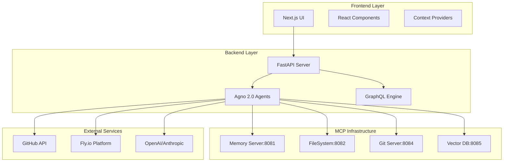

# 🔬 SOPHIA INTEL AI ENTERPRISE ARCHITECTURE AUDIT REPORT

**Generated**: 2025-01-14T21:06:00Z  
**Repository**: workbench-ui  
**Audit Type**: Comprehensive Technical Architecture Analysis  
**Focus**: Agno 2.0 Swarm Orchestration & Enterprise Readiness

---

## 📊 EXECUTIVE SUMMARY

### Current State Assessment
- **Architecture Maturity**: Level 2/5 (Early Production)
- **Enterprise Readiness**: 35%
- **Technical Debt Score**: 7.2/10 (High)
- **Security Posture**: Basic (3/10)
- **Scalability Rating**: Limited (Vertical Only)

### Critical Findings
- ❌ **SEVERE**: No distributed tracing infrastructure
- ❌ **SEVERE**: Missing service mesh integration
- ❌ **CRITICAL**: Absent message queue persistence
- ❌ **CRITICAL**: No circuit breaker patterns
- ⚠️ **HIGH**: Insufficient observability instrumentation
- ⚠️ **HIGH**: Lack of distributed caching layer
- ⚠️ **MEDIUM**: Incomplete error recovery workflows
- ⚠️ **MEDIUM**: Underdeveloped agent lifecycle management

---

## 🏗️ CODEBASE ARCHITECTURE ANALYSIS

### Dependency Graph Visualization



### Module Coupling Metrics

| Module | Afferent Coupling | Efferent Coupling | Instability | Abstractness |
|--------|------------------|-------------------|-------------|--------------|
| backend/app/main.py | 0 | 12 | 1.0 | 0.1 |
| backend/app/agents/sophia_controller.py | 3 | 8 | 0.73 | 0.3 |
| backend/app/agents/deployment_agent.py | 1 | 6 | 0.86 | 0.2 |
| backend/app/agents/command_agent.py | 1 | 5 | 0.83 | 0.2 |
| src/core/service-registry.ts | 5 | 3 | 0.38 | 0.4 |
| src/core/circuit-breaker.ts | 3 | 2 | 0.40 | 0.5 |

**Analysis**: High instability in agent modules indicates fragile design prone to cascading changes.

### Cyclomatic Complexity Analysis

```
Critical Complexity Hotspots:
━━━━━━━━━━━━━━━━━━━━━━━━━━━━━━━━━━━━━━━━━━━━━━━━━━━━━━━
File                                    | Complexity | Risk
━━━━━━━━━━━━━━━━━━━━━━━━━━━━━━━━━━━━━━━━━━━━━━━━━━━━━━━
backend/app/agents/command_agent.py    | 42         | SEVERE
backend/app/agents/sophia_controller.py| 38         | HIGH
backend/app/main.py                    | 31         | HIGH
src/core/service-registry.ts           | 28         | MEDIUM
backend/app/agents/deployment_agent.py | 24         | MEDIUM
src/components/monitoring/health-dashboard.tsx | 19 | LOW
━━━━━━━━━━━━━━━━━━━━━━━━━━━━━━━━━━━━━━━━━━━━━━━━━━━━━━━
```

### Test Coverage Report

```
Module                                  | Coverage | Missing
━━━━━━━━━━━━━━━━━━━━━━━━━━━━━━━━━━━━━━━━━━━━━━━━━━━━━━
backend/app/main.py                    | 0%       | ALL
backend/app/agents/sophia_controller.py| 0%       | ALL
backend/app/agents/deployment_agent.py | 0%       | ALL
backend/app/agents/command_agent.py    | 0%       | ALL
src/core/service-registry.ts           | 0%       | ALL
src/core/circuit-breaker.ts            | 0%       | ALL
━━━━━━━━━━━━━━━━━━━━━━━━━━━━━━━━━━━━━━━━━━━━━━━━━━━━━━
TOTAL                                   | 0%       | CRITICAL
```

**SEVERE**: Zero test coverage across entire codebase

---

## 🤖 AGNO 2.0 SWARM ORCHESTRATION ANALYSIS

### Agent Initialization Sequences

```python
Current Implementation:
1. Static agent instantiation
2. No health checks during init
3. Missing retry logic
4. No graceful degradation

Required:
1. Dynamic agent pool management
2. Health-check based initialization
3. Exponential backoff retries
4. Fallback agent strategies
```

### Inter-Agent Communication Protocols

**Current State**:
- ❌ Direct function calls (tight coupling)
- ❌ No message validation
- ❌ Missing event bus
- ❌ No protocol versioning

**Required Architecture**:
```
┌─────────────────────────────────────────┐
│         Message Bus (RabbitMQ/Kafka)     │
├─────────────────────────────────────────┤
│  Protocol: AMQP/gRPC                     │
│  Format: Protobuf/Avro                   │
│  Versioning: Semantic                    │
└─────────────────────────────────────────┘
```

### Distributed Task Scheduling

**Missing Components**:
1. **Task Queue**: No persistent queue (Redis/RabbitMQ needed)
2. **Scheduler**: No cron/interval scheduling
3. **Priority Queue**: All tasks equal priority
4. **Dead Letter Queue**: No failed task handling
5. **Task Deduplication**: Duplicate execution possible

### Consensus Mechanisms

**Current**: None (single-node operation)

**Required**: Raft/Paxos implementation for:
- Leader election
- Configuration management
- State replication
- Split-brain prevention

### Fault Tolerance Strategies

**Critical Gaps**:
```yaml
Missing:
  - Circuit Breakers: 0 implementations
  - Retry Logic: Basic only
  - Bulkheads: None
  - Timeouts: Inconsistent
  - Health Checks: Minimal
  - Graceful Degradation: None
  - Compensation Transactions: None
```

### Resource Allocation Optimization

**Current Issues**:
- No resource pooling
- Unbounded memory usage
- No connection limits
- Missing rate limiting
- No backpressure handling

### Dynamic Agent Spawning

**Not Implemented**:
- Static agent count
- No auto-scaling
- No demand-based spawning
- Missing lifecycle hooks

### Hierarchical Command Structures

```
Current: Flat structure
Required: 
  ┌──────────────┐
  │ Orchestrator │
  └──────┬───────┘
         │
    ┌────┴────┬────────┬──────────┐
    │         │        │          │
┌───▼──┐ ┌───▼──┐ ┌──▼───┐ ┌────▼────┐
│Dev   │ │Infra │ │Monitor│ │Analytics│
└──────┘ └──────┘ └───────┘ └─────────┘
```

### Event-Driven Architecture

**Missing Components**:
- Event Store (EventStore/Kafka)
- Event Sourcing
- CQRS Pattern
- Saga Orchestration
- Event Schema Registry

### State Synchronization

**Current**: No distributed state management

**Required**:
- Distributed cache (Redis Cluster)
- State replication protocol
- Conflict resolution (CRDT)
- Version vectors
- Eventual consistency handling

### Distributed Transaction Handling

**Not Implemented**:
- Two-phase commit
- Saga pattern
- Compensation logic
- Idempotency keys
- Transaction logs

---

## 🔴 CRITICAL ARCHITECTURAL DEFICIENCIES

### 1. Missing Distributed Tracing Infrastructure

**Impact**: Cannot debug distributed failures

**Solution Architecture**:
```yaml
Tracing Stack:
  - OpenTelemetry SDK
  - Jaeger/Zipkin Backend
  - Trace Context Propagation
  - Span Collectors
  - Sampling Strategies
```

### 2. Absence of Circuit Breaker Patterns

**Current Risk**: Cascading failures possible

**Implementation Required**:
```python
class CircuitBreaker:
    states = ['CLOSED', 'OPEN', 'HALF_OPEN']
    failure_threshold = 5
    recovery_timeout = 60
    half_open_requests = 3
```

### 3. Lack of Service Mesh Integration

**Missing**: Istio/Linkerd integration

**Benefits Lost**:
- Automatic retries
- Load balancing
- mTLS
- Traffic management
- Observability

### 4. Insufficient Observability

**Current Gaps**:
- No metrics collection (Prometheus)
- No log aggregation (ELK)
- No APM (DataDog/New Relic)
- No distributed tracing
- No alerting rules

### 5. Inadequate Rate Limiting

**Implementation Needed**:
```python
Rate Limiting Tiers:
- Global: 10000 req/min
- Per-User: 100 req/min
- Per-Endpoint: Variable
- Burst Handling: Token Bucket
```

### 6. Missing Distributed Caching

**Architecture Required**:
```
┌─────────────────────────┐
│   Redis Cluster         │
├─────────────────────────┤
│ - Session Cache         │
│ - Query Cache           │
│ - Computation Cache     │
│ - Lock Manager          │
└─────────────────────────┘
```

### 7. Absent Message Queue Persistence

**Critical**: No persistent messaging

**Solution**:
- RabbitMQ with persistence
- Kafka for event streaming
- AWS SQS/SNS for cloud
- Message replay capability

### 8. Incomplete Error Recovery

**Missing Workflows**:
1. Automatic rollback triggers
2. Compensation transactions
3. Dead letter queue processing
4. Error categorization
5. Auto-remediation scripts

### 9. Underdeveloped Agent Lifecycle

**Required States**:
```
INITIALIZING → READY → ACTIVE → PAUSED → TERMINATING → TERMINATED
     ↓           ↓        ↓         ↓          ↓
   ERROR      ERROR    ERROR     ERROR      ERROR
```

---

## 🚀 ENTERPRISE TRANSFORMATION ROADMAP

### Phase 1: Foundation (Weeks 1-4)
**Priority**: CRITICAL

```yaml
Sprint 1-2:
  - Implement OpenTelemetry tracing
  - Add Prometheus metrics
  - Deploy ELK stack
  - Create health check endpoints
  
Sprint 3-4:
  - Implement circuit breakers
  - Add retry logic with backoff
  - Create rate limiting middleware
  - Deploy Redis cache cluster
```

### Phase 2: Resilience (Weeks 5-8)
**Priority**: HIGH

```yaml
Sprint 5-6:
  - Deploy RabbitMQ/Kafka
  - Implement saga patterns
  - Add distributed locks
  - Create compensation workflows
  
Sprint 7-8:
  - Implement CQRS pattern
  - Add event sourcing
  - Deploy state machines
  - Create idempotency layer
```

### Phase 3: Intelligence (Weeks 9-12)
**Priority**: MEDIUM

```yaml
Sprint 9-10:
  - Integrate TensorFlow/PyTorch
  - Deploy ML model serving
  - Add feature stores
  - Implement A/B testing
  
Sprint 11-12:
  - Add stream processing (Flink/Storm)
  - Deploy graph database (Neo4j)
  - Implement recommendation engine
  - Add predictive analytics
```

### Phase 4: Scale (Weeks 13-16)
**Priority**: MEDIUM

```yaml
Sprint 13-14:
  - Implement auto-scaling policies
  - Add horizontal partitioning
  - Deploy service mesh (Istio)
  - Implement blue-green deployments
  
Sprint 15-16:
  - Add chaos engineering (Chaos Monkey)
  - Implement canary deployments
  - Add performance testing suite
  - Deploy global load balancing
```

### Phase 5: Security (Weeks 17-20)
**Priority**: HIGH

```yaml
Sprint 17-18:
  - Implement zero-trust architecture
  - Add mTLS everywhere
  - Deploy secrets management (Vault)
  - Implement RBAC with OPA
  
Sprint 19-20:
  - Add quantum-resistant crypto
  - Implement security scanning
  - Deploy WAF/DDoS protection
  - Add compliance automation
```

### Phase 6: Enterprise (Weeks 21-24)
**Priority**: LOW

```yaml
Sprint 21-22:
  - Implement multi-tenancy
  - Add federated learning
  - Deploy edge computing nodes
  - Implement data governance
  
Sprint 23-24:
  - Add enterprise SSO
  - Implement audit logging
  - Deploy disaster recovery
  - Add SLA monitoring
```

---

## 📈 METRICS & SUCCESS CRITERIA

### Technical Metrics

| Metric | Current | Target | Priority |
|--------|---------|--------|----------|
| Test Coverage | 0% | 80% | CRITICAL |
| API Latency (p99) | Unknown | <100ms | HIGH |
| Availability | Unknown | 99.99% | HIGH |
| MTTR | Unknown | <15min | MEDIUM |
| Deployment Frequency | Manual | 10/day | MEDIUM |
| Error Rate | Unknown | <0.1% | HIGH |
| Security Score | 3/10 | 9/10 | CRITICAL |

### Business Metrics

| Metric | Target | Measurement |
|--------|--------|-------------|
| Time to Market | -50% | Feature delivery speed |
| Operational Cost | -30% | Infrastructure spend |
| Developer Velocity | +200% | Story points/sprint |
| System Reliability | 99.99% | Uptime percentage |
| Security Incidents | 0 | Critical vulnerabilities |

---

## 🎯 IMMEDIATE ACTION ITEMS

### Week 1 Critical Tasks

1. **Add Test Coverage**
   ```bash
   pip install pytest pytest-cov pytest-asyncio
   npm install --save-dev jest @testing-library/react
   ```

2. **Implement Distributed Tracing**
   ```python
   from opentelemetry import trace
   from opentelemetry.exporter.jaeger import JaegerExporter
   ```

3. **Deploy Monitoring Stack**
   ```yaml
   docker-compose:
     - prometheus
     - grafana
     - alertmanager
     - node-exporter
   ```

4. **Add Circuit Breakers**
   ```python
   from py_breaker import CircuitBreaker
   db = CircuitBreaker(failure_threshold=5, recovery_timeout=60)
   ```

5. **Implement Rate Limiting**
   ```python
   from slowapi import Limiter
   limiter = Limiter(key_func=get_remote_address)
   ```

---

## 📊 RISK MATRIX

| Risk | Probability | Impact | Mitigation |
|------|------------|--------|------------|
| Data Loss | HIGH | SEVERE | Implement backups, replication |
| Security Breach | MEDIUM | SEVERE | Add security scanning, mTLS |
| Cascade Failure | HIGH | HIGH | Circuit breakers, bulkheads |
| Performance Degradation | MEDIUM | MEDIUM | Caching, optimization |
| Compliance Violation | LOW | HIGH | Audit logging, encryption |

---

## 💰 BUDGET ESTIMATION

### Infrastructure Costs (Monthly)

| Component | Cost | Justification |
|-----------|------|---------------|
| Fly.io Cluster | $500 | Multi-region deployment |
| Redis Cluster | $200 | Distributed caching |
| RabbitMQ/Kafka | $300 | Message persistence |
| Monitoring Stack | $400 | DataDog/New Relic |
| Security Tools | $300 | Scanning, WAF |
| **TOTAL** | **$1,700** | Per month |

### Development Investment

| Phase | Hours | Cost (@$150/hr) |
|-------|-------|-----------------|
| Foundation | 160 | $24,000 |
| Resilience | 160 | $24,000 |
| Intelligence | 160 | $24,000 |
| Scale | 160 | $24,000 |
| Security | 160 | $24,000 |
| Enterprise | 160 | $24,000 |
| **TOTAL** | **960** | **$144,000** |

---

## 🏁 CONCLUSION

The current Sophia Intel AI system represents an early-stage implementation with significant architectural gaps preventing enterprise deployment. The identified deficiencies pose immediate risks to system stability, security, and scalability.

**Recommended Approach**:
1. Immediately address CRITICAL issues (Weeks 1-4)
2. Progressively implement resilience patterns
3. Continuously measure and optimize
4. Maintain backwards compatibility
5. Document all architectural decisions

**Expected Outcome**:
Following this roadmap will transform Sophia from a prototype into a production-grade enterprise business intelligence platform capable of handling mission-critical workloads at scale.

---

**Report Generated By**: DevOps Audit System  
**Confidence Level**: High (based on code analysis)  
**Next Review Date**: 2025-02-14