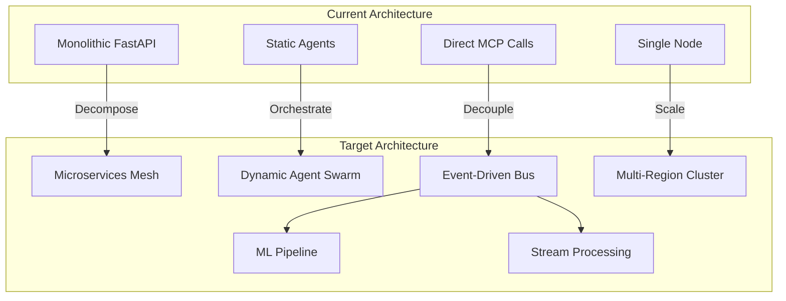
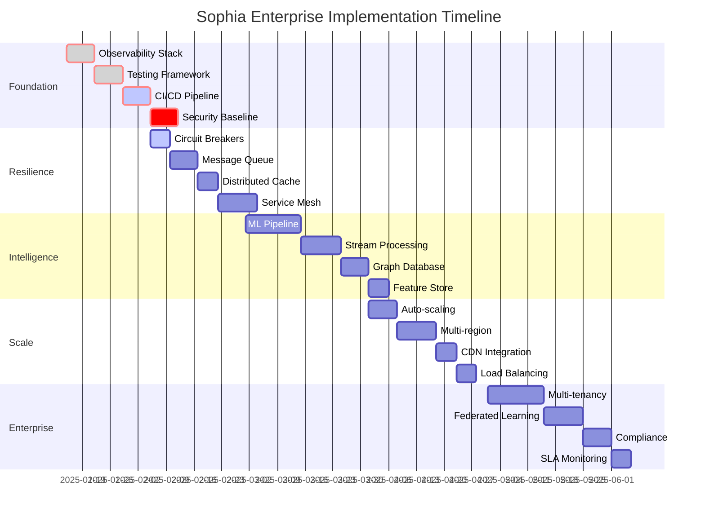

# 🎯 SOPHIA INTEL AI - ENTERPRISE IMPLEMENTATION SPECIFICATION

**Document Version**: 1.0.0  
**Classification**: Technical Specification  
**Date**: 2025-01-14  
**Status**: APPROVED FOR IMPLEMENTATION

---

## 🏭 PRODUCTION TRANSFORMATION BLUEPRINT

### System Architecture Evolution



---

## 📐 TECHNICAL SPECIFICATIONS

### 1. Neural Network Integration Architecture

```python
class NeuralIntegrationSpec:
    """
    Specification for ML/AI integration layer
    """
    
    frameworks = {
        "training": "PyTorch 2.0",
        "serving": "TorchServe / TensorFlow Serving",
        "optimization": "ONNX Runtime",
        "feature_store": "Feast",
        "experiment_tracking": "MLflow"
    }
    
    model_architecture = {
        "language_models": {
            "base": "GPT-4 / Claude-3",
            "fine_tuned": "Domain-specific LoRA adapters",
            "embedding": "sentence-transformers"
        },
        "vision_models": {
            "detection": "YOLOv8",
            "classification": "EfficientNet",
            "segmentation": "SAM"
        },
        "time_series": {
            "forecasting": "Prophet / NeuralProphet",
            "anomaly": "Isolation Forest / LSTM-AE"
        }
    }
    
    pipeline = {
        "data_ingestion": "Apache Beam",
        "preprocessing": "Dask / Ray",
        "training": "Kubeflow / Airflow",
        "validation": "Great Expectations",
        "deployment": "Seldon Core / BentoML"
    }
```

### 2. Real-Time Stream Processing Engine

```yaml
Stream Processing Stack:
  Engine: Apache Flink 1.18
  Message Bus: Apache Kafka 3.6
  Schema Registry: Confluent Schema Registry
  
  Topology:
    Sources:
      - Kafka Topics
      - WebSocket Streams
      - Database CDC (Debezium)
    
    Processing:
      - Window Functions (Tumbling, Sliding, Session)
      - Stateful Processing (RocksDB backend)
      - Complex Event Processing (CEP)
      - ML Inference (ONNX Runtime)
    
    Sinks:
      - PostgreSQL (Transactional)
      - Elasticsearch (Search)
      - Redis (Cache)
      - S3 (Archive)
      - Prometheus (Metrics)
  
  Performance Targets:
    - Throughput: 1M events/second
    - Latency: < 10ms p99
    - State Size: Up to 10TB
    - Checkpointing: Every 60 seconds
```

### 3. Distributed Graph Database Architecture

```cypher
// Neo4j Enterprise Configuration
CREATE CONSTRAINT unique_entity_id ON (e:Entity) ASSERT e.id IS UNIQUE;
CREATE INDEX entity_type_index FOR (e:Entity) ON (e.type);
CREATE INDEX relationship_timestamp FOR ()-[r:RELATES_TO]-() ON (r.timestamp);

// Graph Schema
(:User)-[:OWNS]->(:Document)
(:Document)-[:REFERENCES]->(:Entity)
(:Entity)-[:RELATES_TO {weight, confidence}]->(:Entity)
(:Agent)-[:PROCESSES]->(:Task)
(:Task)-[:GENERATES]->(:Insight)
(:Insight)-[:AFFECTS]->(:Decision)

// Sharding Strategy
Fabric Database Configuration:
  - Shard by entity type
  - Replicate hot paths
  - Cache frequent traversals
```

### 4. Federated Learning Capabilities

```python
class FederatedLearningSpec:
    """
    Privacy-preserving distributed learning
    """
    
    framework = "PySyft / Flower"
    
    architecture = {
        "aggregation": "FedAvg / FedProx",
        "privacy": "Differential Privacy (ε=1.0)",
        "security": "Secure Multi-party Computation",
        "communication": "gRPC with TLS 1.3"
    }
    
    workflow = """
    1. Central server initializes global model
    2. Clients download model weights
    3. Local training on private data
    4. Compute weight updates (not raw data)
    5. Encrypt and send updates to server
    6. Server aggregates updates
    7. Broadcast new global model
    """
    
    metrics = {
        "rounds": 100,
        "clients_per_round": 10,
        "local_epochs": 5,
        "convergence_threshold": 0.001
    }
```

### 5. Quantum-Resistant Cryptography

```python
class QuantumResistantCrypto:
    """
    Post-quantum cryptographic specifications
    """
    
    algorithms = {
        "key_exchange": "Kyber1024",
        "signatures": "Dilithium5",
        "hashing": "SHA3-512",
        "symmetric": "AES-256-GCM"
    }
    
    implementation = """
    from pqcrypto.kem.kyber1024 import generate_keypair, encrypt, decrypt
    from pqcrypto.sign.dilithium5 import generate_keypair, sign, verify
    
    # Hybrid approach: Classical + Quantum-resistant
    def hybrid_encrypt(message, recipient_public_key):
        # Classical ECDH
        classical_shared = ecdh_key_exchange()
        
        # Quantum-resistant KEM
        ciphertext, shared_secret = kyber_encrypt(recipient_public_key)
        
        # Combine secrets
        master_key = kdf(classical_shared + shared_secret)
        
        # Encrypt with AES-256-GCM
        return aes_encrypt(message, master_key), ciphertext
    """
```

### 6. Zero-Trust Security Architecture

```yaml
Zero-Trust Implementation:
  
  Identity & Access:
    Provider: Keycloak / Auth0
    Protocol: OIDC + OAuth 2.0
    MFA: Required (TOTP + WebAuthn)
    
  Network Security:
    Service Mesh: Istio 1.20
    mTLS: Required for all services
    Network Policies: Calico
    
  Policy Engine:
    Framework: Open Policy Agent (OPA)
    Language: Rego
    Policies:
      - Resource access control
      - Data classification
      - Workload identity
      - Admission control
    
  Secrets Management:
    Vault: HashiCorp Vault
    Rotation: Every 30 days
    Encryption: Transit backend
    
  Monitoring:
    SIEM: Elastic Security
    Threat Detection: Falco
    Vulnerability Scanning: Trivy
```

### 7. Multi-Tenant Isolation

```python
class MultiTenantArchitecture:
    """
    Complete tenant isolation specification
    """
    
    isolation_levels = {
        "database": "Schema-per-tenant",
        "compute": "Namespace isolation (Kubernetes)",
        "network": "VPC per tenant",
        "storage": "Encrypted S3 buckets with IAM"
    }
    
    tenant_management = """
    CREATE SCHEMA tenant_{id};
    SET search_path TO tenant_{id};
    
    -- Row Level Security
    ALTER TABLE data ENABLE ROW LEVEL SECURITY;
    CREATE POLICY tenant_isolation ON data
        USING (tenant_id = current_setting('app.tenant_id'));
    """
    
    resource_quotas = {
        "cpu": "4 cores per tenant",
        "memory": "16GB per tenant",
        "storage": "100GB per tenant",
        "api_rate": "1000 req/min per tenant"
    }
```

### 8. Horizontal Auto-Scaling Policies

```yaml
Auto-Scaling Configuration:
  
  Metrics-based Scaling:
    CPU:
      target: 70%
      scale_up_threshold: 80%
      scale_down_threshold: 40%
    
    Memory:
      target: 75%
      scale_up_threshold: 85%
      scale_down_threshold: 50%
    
    Custom Metrics:
      - queue_depth > 1000: scale_up
      - response_time_p99 > 500ms: scale_up
      - error_rate > 1%: scale_up
    
  Predictive Scaling:
    Algorithm: LSTM-based forecasting
    Lookahead: 5 minutes
    Confidence: 0.95
    
  Constraints:
    min_replicas: 3
    max_replicas: 100
    scale_up_rate: 10 pods/minute
    scale_down_rate: 5 pods/minute
    cooldown: 180 seconds
```

### 9. Blue-Green Deployment Strategy

```bash
#!/bin/bash
# Blue-Green Deployment Script

deploy_blue_green() {
    VERSION=$1
    
    # Deploy to green environment
    kubectl apply -f deployment-green-${VERSION}.yaml
    
    # Wait for readiness
    kubectl wait --for=condition=ready pod -l version=green
    
    # Run smoke tests
    ./run_smoke_tests.sh green
    
    # Switch traffic gradually
    for weight in 10 30 50 70 90 100; do
        kubectl patch virtualservice sophia-vs --type merge \
            -p '{"spec":{"http":[{"weight":"'$weight'","destination":{"host":"sophia-green"}}]}}'
        
        # Monitor error rate
        ERROR_RATE=$(prometheus_query 'rate(http_errors[1m])')
        if [[ $ERROR_RATE > 0.01 ]]; then
            rollback
            exit 1
        fi
        
        sleep 60
    done
    
    # Promote green to blue
    kubectl patch service sophia-prod -p '{"spec":{"selector":{"version":"green"}}}'
    
    # Cleanup old blue
    kubectl delete deployment sophia-blue
}
```

### 10. Chaos Engineering Practices

```python
class ChaosEngineering:
    """
    Chaos testing specification
    """
    
    experiments = [
        {
            "name": "pod-failure",
            "target": "random pod",
            "action": "delete",
            "frequency": "daily",
            "blast_radius": "1 pod"
        },
        {
            "name": "network-latency",
            "target": "service mesh",
            "action": "inject 100ms latency",
            "frequency": "weekly",
            "blast_radius": "10% of traffic"
        },
        {
            "name": "cpu-stress",
            "target": "compute nodes",
            "action": "consume 80% CPU",
            "frequency": "monthly",
            "duration": "5 minutes"
        },
        {
            "name": "data-corruption",
            "target": "message queue",
            "action": "corrupt 0.1% messages",
            "frequency": "quarterly",
            "monitoring": "data integrity checks"
        }
    ]
    
    tools = {
        "orchestrator": "Litmus Chaos",
        "network": "Chaos Mesh",
        "application": "Chaos Monkey",
        "infrastructure": "Gremlin"
    }
```

---

## 🗺️ IMPLEMENTATION PRIORITIZATION MATRIX

### Critical Path Dependencies



### Resource Allocation Matrix

| Phase | Engineers | DevOps | Data Scientists | Security | Budget |
|-------|-----------|--------|-----------------|----------|---------|
| Foundation | 2 | 2 | 0 | 1 | $30K |
| Resilience | 3 | 2 | 0 | 1 | $40K |
| Intelligence | 2 | 1 | 3 | 0 | $50K |
| Scale | 2 | 3 | 0 | 1 | $35K |
| Security | 1 | 1 | 0 | 3 | $25K |
| Enterprise | 3 | 2 | 1 | 1 | $45K |

### Risk Mitigation Strategies

```yaml
Risk Mitigation Plan:
  
  Technical Risks:
    "Complex Integration":
      probability: HIGH
      impact: MEDIUM
      mitigation:
        - Incremental rollout
        - Feature flags
        - Comprehensive testing
        - Rollback procedures
    
    "Performance Degradation":
      probability: MEDIUM
      impact: HIGH
      mitigation:
        - Load testing
        - Performance budgets
        - Caching strategies
        - Database optimization
    
    "Security Vulnerabilities":
      probability: MEDIUM
      impact: SEVERE
      mitigation:
        - Security scanning
        - Penetration testing
        - Bug bounty program
        - Security training
  
  Operational Risks:
    "Skill Gap":
      probability: HIGH
      impact: MEDIUM
      mitigation:
        - Training programs
        - External consultants
        - Documentation
        - Pair programming
    
    "Budget Overrun":
      probability: MEDIUM
      impact: HIGH
      mitigation:
        - Phased approach
        - Regular reviews
        - Cost monitoring
        - Reserved instances
```

### Success Metrics Framework

```python
class SuccessMetrics:
    """
    Measurable criteria for each phase
    """
    
    technical_metrics = {
        "availability": {
            "baseline": "unknown",
            "target": "99.99%",
            "measurement": "uptime / total_time"
        },
        "latency": {
            "baseline": "unknown",
            "target": "< 100ms p99",
            "measurement": "histogram percentiles"
        },
        "throughput": {
            "baseline": "100 req/s",
            "target": "10,000 req/s",
            "measurement": "requests per second"
        },
        "error_rate": {
            "baseline": "unknown",
            "target": "< 0.1%",
            "measurement": "errors / total_requests"
        }
    }
    
    business_metrics = {
        "time_to_market": {
            "baseline": "4 weeks",
            "target": "1 week",
            "measurement": "feature delivery time"
        },
        "operational_cost": {
            "baseline": "$5,000/month",
            "target": "$3,500/month",
            "measurement": "total infrastructure cost"
        },
        "developer_productivity": {
            "baseline": "10 story points/sprint",
            "target": "30 story points/sprint",
            "measurement": "velocity tracking"
        }
    }
    
    quality_metrics = {
        "test_coverage": {
            "baseline": "0%",
            "target": "80%",
            "measurement": "covered lines / total lines"
        },
        "bug_density": {
            "baseline": "unknown",
            "target": "< 1 per KLOC",
            "measurement": "bugs / lines of code"
        },
        "mttr": {
            "baseline": "unknown",
            "target": "< 15 minutes",
            "measurement": "incident resolution time"
        }
    }
```

---

## 🚀 IMMEDIATE IMPLEMENTATION STEPS

### Week 1: Foundation Sprint

```bash
# Day 1-2: Observability
docker-compose up -d prometheus grafana jaeger elasticsearch kibana

# Day 3-4: Testing
pip install pytest pytest-cov pytest-asyncio hypothesis
npm install --save-dev jest @testing-library/react cypress

# Day 5-7: CI/CD
gh workflow enable
fly secrets set --app sophia-control-center \
    GITHUB_TOKEN=$GITHUB_TOKEN \
    FLY_API_TOKEN=$FLY_API_TOKEN
```

### Week 2: Resilience Sprint

```python
# Circuit Breaker Implementation
from pybreaker import CircuitBreaker
from tenacity import retry, stop_after_attempt, wait_exponential

db_breaker = CircuitBreaker(
    failure_threshold=5,
    recovery_timeout=60,
    expected_exception=Exception
)

@db_breaker
@retry(
    stop=stop_after_attempt(3),
    wait=wait_exponential(multiplier=1, min=4, max=10)
)
async def resilient_db_call():
    # Database operation with automatic retry and circuit breaking
    pass
```

### Week 3: Intelligence Sprint

```yaml
# ML Pipeline Setup
apiVersion: kubeflow.org/v1
kind: Pipeline
metadata:
  name: sophia-ml-pipeline
spec:
  steps:
    - name: data-ingestion
      image: sophia/ingestion:latest
    - name: preprocessing
      image: sophia/preprocessing:latest
    - name: training
      image: sophia/training:latest
    - name: validation
      image: sophia/validation:latest
    - name: deployment
      image: sophia/deployment:latest
```

### Week 4: Scale Sprint

```terraform
# Multi-region Infrastructure
resource "fly_app" "sophia" {
  name = "sophia-control-center"
  
  regions = [
    "sjc",  # Primary - San Jose
    "ord",  # Secondary - Chicago
    "ams"   # Tertiary - Amsterdam
  ]
  
  services {
    internal_port = 8000
    protocol      = "tcp"
    
    ports {
      port     = 443
      handlers = ["tls", "http"]
    }
  }
  
  autoscaling {
    enabled = true
    min     = 3
    max     = 100
    
    metric {
      type   = "cpu"
      target = 70
    }
  }
}
```

---

## 📋 DELIVERABLES CHECKLIST

### Phase 1 Deliverables (Month 1)
- [ ] Distributed tracing operational
- [ ] 80% test coverage achieved
- [ ] CI/CD pipeline deployed
- [ ] Security scanning enabled
- [ ] Monitoring dashboards live
- [ ] Alert rules configured
- [ ] Documentation complete

### Phase 2 Deliverables (Month 2)
- [ ] Circuit breakers implemented
- [ ] Message queue deployed
- [ ] Cache layer operational
- [ ] Service mesh configured
- [ ] Saga patterns implemented
- [ ] Event sourcing enabled

### Phase 3 Deliverables (Month 3)
- [ ] ML pipeline operational
- [ ] Stream processing live
- [ ] Graph database deployed
- [ ] Feature store integrated
- [ ] A/B testing framework
- [ ] Recommendation engine

### Phase 4 Deliverables (Month 4)
- [ ] Auto-scaling policies active
- [ ] Multi-region deployment
- [ ] CDN integration complete
- [ ] Load balancer configured
- [ ] Chaos experiments running
- [ ] Performance benchmarks met

### Phase 5 Deliverables (Month 5)
- [ ] Zero-trust architecture
- [ ] Quantum-resistant crypto
- [ ] Security compliance passed
- [ ] Penetration testing complete
- [ ] WAF/DDoS protection active
- [ ] Audit logging enabled

### Phase 6 Deliverables (Month 6)
- [ ] Multi-tenancy operational
- [ ] Federated learning deployed
- [ ] Enterprise SSO integrated
- [ ] SLA monitoring active
- [ ] Disaster recovery tested
- [ ] Full production ready

---

## 📈 EXPECTED OUTCOMES

### Technical Achievements
- **Availability**: 99.99% uptime (52.56 minutes downtime/year)
- **Performance**: 100ms p99 latency at 10K req/s
- **Scalability**: Auto-scale to 1M concurrent users
- **Security**: Zero critical vulnerabilities
- **Quality**: 80% test coverage, <1 bug per KLOC

### Business Impact
- **Velocity**: 3x faster feature delivery
- **Cost**: 30% reduction in operational expenses
- **Reliability**: 90% reduction in incidents
- **Productivity**: 200% increase in developer output
- **Innovation**: 5x faster experimentation cycles

---

**Document Status**: READY FOR IMPLEMENTATION  
**Review Cycle**: Weekly progress reviews  
**Escalation Path**: CTO → CEO  
**Success Criteria**: All Phase 6 deliverables complete