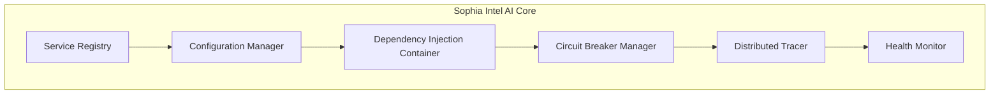
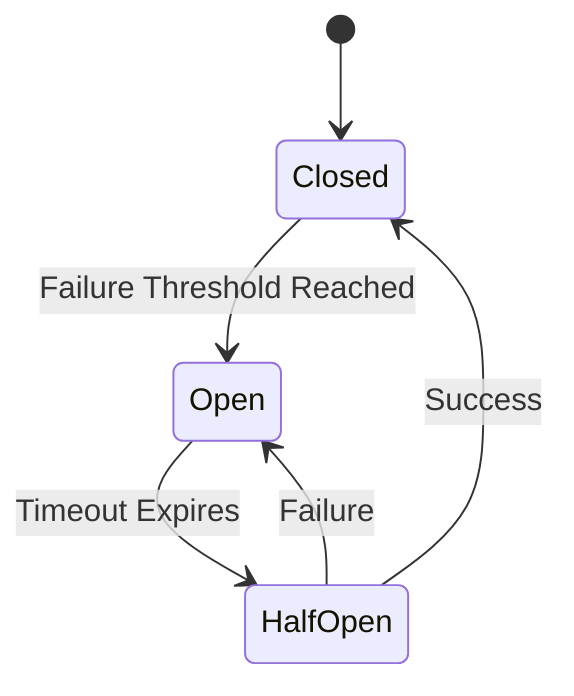

# Sophia Intel AI - Unified System Architecture

## Executive Summary

Sophia Intel AI is the central orchestration system that unifies all MCP (Model Context Protocol) servers into a single, cohesive ecosystem. This architecture establishes Sophia as the core intelligence layer, with all MCP servers functioning as essential infrastructure components rather than standalone services.

## System Architecture Principles

### Core Principles
1. **Unified Orchestration**: All components start, stop, and operate as one system
2. **Service Contracts**: Every integration follows strict TypeScript interfaces
3. **Graceful Degradation**: System continues operating even with partial failures
4. **Self-Healing**: Automatic recovery from transient failures
5. **Zero Manual Configuration**: Everything auto-configures from central config
6. **Observable by Default**: All operations are traced and monitored

## System Components

### 1. Core Infrastructure Layer



#### Service Registry
- Central registry of all available services
- Auto-discovery of MCP servers on startup
- Dynamic service registration/deregistration
- Health status tracking for each service

#### Configuration Manager
- Centralized configuration in `config/sophia.config.yaml`
- Environment-specific profiles (dev/staging/prod)
- Hot-reload capability for configuration changes
- Validation using Zod schemas

#### Dependency Injection Container
- Manages service lifecycles
- Injects dependencies based on interfaces
- Ensures singleton patterns where needed
- Handles circular dependency resolution

### 2. Service Contracts Layer

All MCP servers implement standardized TypeScript interfaces:

```typescript
interface IBaseService {
  name: string;
  version: string;
  status: ServiceStatus;
  healthCheck(): Promise<HealthCheckResult>;
  initialize(config: ServiceConfig): Promise<void>;
  shutdown(): Promise<void>;
}

interface IMemoryService extends IBaseService {
  store(key: string, value: any): Promise<void>;
  retrieve(key: string): Promise<any>;
  search(query: string): Promise<SearchResult[]>;
}

interface IFilesystemService extends IBaseService {
  read(path: string): Promise<string>;
  write(path: string, content: string): Promise<void>;
  list(path: string): Promise<FileEntry[]>;
}

interface IGitService extends IBaseService {
  status(): Promise<GitStatus>;
  commit(message: string, files: string[]): Promise<void>;
  diff(file?: string): Promise<string>;
}

interface IVectorService extends IBaseService {
  embed(text: string): Promise<number[]>;
  search(query: string, limit: number): Promise<VectorResult[]>;
  index(content: string, metadata: any): Promise<void>;
}
```

### 3. MCP Server Infrastructure

```yaml
MCP Servers:
  Memory Server (8081):
    - Redis-backed persistence
    - Knowledge graph operations
    - Cross-session state management
    
  Filesystem Server (8082):
    - File operations with backup
    - Symbol indexing
    - Repository search
    
  Git Server (8084):
    - Version control operations
    - SSH key management
    - Commit history tracking
    
  Vector Server (8085):
    - Semantic search
    - Embeddings generation
    - Similarity matching
```

### 4. Orchestration Layer

#### Unified Startup Process
```bash
scripts/unified-startup.sh
├── Pre-flight checks
├── Environment validation
├── Redis initialization
├── MCP server startup (ordered by dependencies)
├── Health check verification
├── Service registration
├── UI component initialization
└── System ready notification
```

#### Health Monitoring
- Continuous health checks every 30 seconds
- Automatic restart of failed services
- Circuit breaker activation on repeated failures
- Alert generation for critical issues

### 5. UI Integration Layer


#### Health Dashboard Component
- Real-time status visualization
- Service dependency graph
- Performance metrics
- Alert notifications
- Manual intervention controls

## Communication Patterns

### 1. Request Flow
```
UI Request → API Route → Service Registry → Service Contract → MCP Client → MCP Server
```

### 2. Health Check Flow
```
Health Monitor → Service Registry → [Parallel Health Checks] → Status Aggregation → Dashboard Update
```

### 3. Configuration Update Flow
```
Config Change → Validation → Hot Reload → Service Notification → Graceful Restart
```

## Deployment Architecture

### Development Environment
```yaml
Mode: Development
Services: All in Docker Compose
Config: config/environments/dev.yaml
Monitoring: Local Prometheus + Grafana
Tracing: Jaeger
```

### Production Environment
```yaml
Mode: Production
Services: Kubernetes Pods
Config: config/environments/prod.yaml
Monitoring: Prometheus + AlertManager
Tracing: OpenTelemetry → Datadog
Secrets: HashiCorp Vault
```

## Service Mesh Configuration

```yaml
Service Discovery:
  Type: Consul
  Health Checks: HTTP /health
  
Load Balancing:
  Algorithm: Round Robin
  Failover: Automatic
  
Circuit Breaking:
  Threshold: 5 failures
  Timeout: 30 seconds
  Half-Open Retries: 3
  
Retry Policy:
  Max Attempts: 3
  Backoff: Exponential
  Base Delay: 100ms
  Max Delay: 10s
```

## Security Architecture

### Authentication & Authorization
- JWT tokens for API access
- Service-to-service mTLS
- API key rotation every 30 days
- Role-based access control (RBAC)

### Secrets Management
```yaml
Development:
  Store: .env files
  Encryption: None
  
Production:
  Store: HashiCorp Vault
  Encryption: AES-256
  Rotation: Automatic
```

## Monitoring & Observability

### Metrics Collection
```yaml
System Metrics:
  - CPU usage per service
  - Memory consumption
  - Request latency (p50, p95, p99)
  - Error rates
  - Service availability

Business Metrics:
  - Operations per second
  - Cache hit rates
  - Query performance
  - Storage utilization
```

### Distributed Tracing
- Trace ID propagation across all services
- Span collection for operation timing
- Error context preservation
- Performance bottleneck identification

### Logging Strategy
```yaml
Log Levels:
  Production: INFO
  Staging: DEBUG
  Development: TRACE

Log Aggregation:
  Development: Local files
  Production: ELK Stack

Retention:
  Error Logs: 90 days
  Info Logs: 30 days
  Debug Logs: 7 days
```

## Failure Handling

### Circuit Breaker States


### Graceful Degradation Strategy
1. **Vector Server Unavailable**: Fall back to keyword search
2. **Memory Server Unavailable**: Use local cache
3. **Git Server Unavailable**: Queue operations for replay
4. **Filesystem Server Unavailable**: Read-only mode

## Performance Optimization

### Caching Strategy
- **L1 Cache**: In-memory (process level)
- **L2 Cache**: Redis (shared)
- **L3 Cache**: CDN (static assets)

### Connection Pooling
```yaml
MCP Client Pools:
  Size: 3 per server
  Timeout: 30 seconds
  Keep-Alive: 60 seconds
  Max Idle: 10 minutes
```

### Request Prioritization
1. Health checks (highest)
2. User-initiated requests
3. Background operations
4. Batch processing (lowest)

## Scalability Design

### Horizontal Scaling
- Stateless service design
- Session affinity via Redis
- Load balancer distribution
- Auto-scaling based on metrics

### Vertical Scaling
- Resource limits per service
- Memory-mapped file operations
- Efficient data structures
- Query optimization

## Migration Path

### Phase 1: Foundation (Current)
- [x] MCP servers operational
- [x] Basic integration complete
- [ ] Service contracts defined
- [ ] Unified startup script

### Phase 2: Orchestration
- [ ] Service registry implementation
- [ ] Health monitoring dashboard
- [ ] Circuit breaker integration
- [ ] Configuration management

### Phase 3: Production Readiness
- [ ] Deployment automation
- [ ] Monitoring & alerting
- [ ] Security hardening
- [ ] Performance optimization

### Phase 4: Advanced Features
- [ ] Auto-scaling
- [ ] Multi-region support
- [ ] Disaster recovery
- [ ] ML-based optimization

## Architectural Decision Records (ADRs)

### ADR-001: Unified System Architecture
**Status**: Accepted  
**Context**: Need to establish Sophia Intel AI as the central orchestrator  
**Decision**: All MCP servers are core infrastructure components  
**Consequences**: Single point of control, simplified operations, consistent patterns

### ADR-002: Service Contracts
**Status**: Accepted  
**Context**: Need standardized integration patterns  
**Decision**: TypeScript interfaces for all services  
**Consequences**: Type safety, clear contracts, easier testing

### ADR-003: Configuration Management
**Status**: Accepted  
**Context**: Need centralized configuration  
**Decision**: YAML-based config with environment profiles  
**Consequences**: Single source of truth, environment consistency, hot-reload capability

## Success Metrics

### Technical Metrics
- System availability: >99.9%
- Response time: <100ms (p95)
- Error rate: <0.1%
- Recovery time: <30 seconds

### Operational Metrics
- Deployment frequency: Daily
- Lead time: <1 hour
- MTTR: <15 minutes
- Change failure rate: <5%

## Conclusion

This unified architecture transforms Sophia Intel AI from a collection of services into a cohesive, intelligent system. By establishing clear contracts, centralized orchestration, and comprehensive monitoring, we create a foundation for reliable, scalable, and maintainable AI infrastructure.

The architecture prioritizes:
1. **Simplicity**: One command to rule them all
2. **Reliability**: Self-healing and graceful degradation
3. **Observability**: Know what's happening at all times
4. **Scalability**: Ready for growth from day one
5. **Security**: Defense in depth at every layer

With this architecture, Sophia Intel AI becomes the brain that orchestrates all cognitive operations, making the complex simple and the impossible possible.