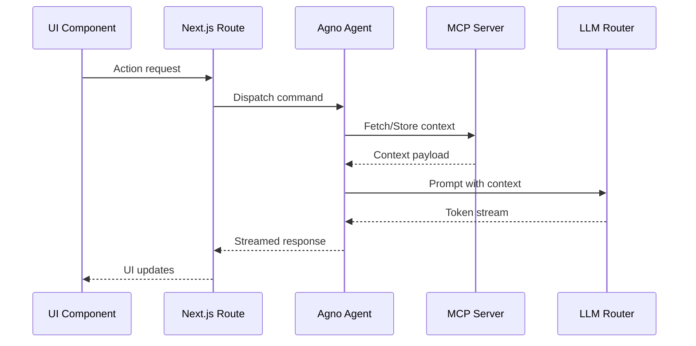
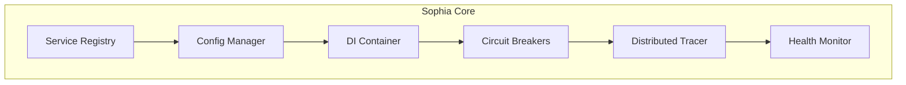

# Architecture

## System Overview
Workbench UI is the operator-facing front end for Sophia Intel AI. A Next.js 14 application renders the real-time control surface, while the Sophia backend (FastAPI + Agno agents) exposes orchestration APIs and adapters into the Model Context Protocol (MCP) servers. Together they provide a unified environment to observe, command, and automate agent workflows.

## Frontend Composition

```mermaid
graph TB
  subgraph "Next.js App Router"
    A[App Router] --> P[Pages]
    P --> H[Home Dashboard]
    P --> AG[Agent Control]
    P --> WF[Workflows]
    P --> ST[Settings]
    
    A --> C[Components]
    C --> C1[Agent Cards]
    C --> C2[MCP Status Widgets]
    C --> C3[SSE Log Viewer]
    
    A --> S[State]
    S --> Z[Zustand Stores]
    S --> Q[React Query Cache]
  end
  
  subgraph "API Routes"
    R[/api/agents]
    M[/api/mcp]
    W[/api/workflows]
    WS[/api/websocket]
  end

  subgraph "Sophia Backend"
    B[Agno Agents]
    F[FastAPI Controller]
    T[Telemetry]
  end

  subgraph "MCP Servers"
    MEM[Memory 8081]
    FS[Filesystem 8082]
    GIT[Git 8084]
    VEC[Vector 8085]
  end

  R --> F
  M --> F
  W --> F
  F --> B
  B --> MEM
  B --> FS
  B --> GIT
  B --> VEC
  F --> T
```

Key directories:

```
src/
├── app/           # App Router routes and layouts
├── components/    # UI building blocks
├── core/          # Shared domain logic
├── lib/           # MCP clients, helpers, and adapters
├── types/         # TypeScript contracts
└── config/        # Route-level configuration
```

## Interaction Flow



## Platform Architecture
Sophia Intel AI centralizes orchestration, configuration, and health monitoring for every MCP service. Core subsystems share a unified configuration file (`config/sophia.config.yaml`) and expose health signals that the UI consumes.



- **Service Registry** keeps track of active MCP services and their metadata.
- **Configuration Manager** loads profiles for dev/staging/prod and validates them with schemas.
- **Dependency Injection** wires agents, clients, and telemetry providers with consistent lifecycles.
- **Circuit Breakers & Tracing** ensure graceful degradation and detailed observability.

## MCP Services

| Service | Port | Responsibilities |
|---------|------|------------------|
| Memory | 8081 | Conversational context persistence, semantic search, and shared agent state |
| Filesystem | 8082 | Safe repository access, symbol indexing, and file annotations |
| Git | 8084 | Version control operations, diffing, and commit orchestration |
| Vector | 8085 | Embedding generation, similarity queries, and vector storage |

Each service implements a common contract:

```typescript
interface BaseService {
  name: string;
  version: string;
  status: "healthy" | "degraded" | "down";
  healthCheck(): Promise<HealthCheckResult>;
  initialize(config: ServiceConfig): Promise<void>;
  shutdown(): Promise<void>;
}
```

These uniform interfaces make it straightforward for the UI to present health dashboards, for agents to swap implementations, and for future services to plug into the system.
