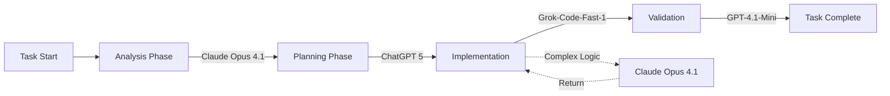

# Optimal AI Model Selection for Custom Roo Modes

## Available AI Models & Characteristics

| Model | Strength | Best Use Cases | Cost |
|-------|----------|----------------|------|
| **Claude Opus 4.1** | Complex reasoning, nuanced analysis | Architecture, logic verification | High |
| **ChatGPT 5** | Versatile general-purpose, enhanced capabilities | Multi-step workflows, documentation | Medium-High |
| **Grok-Code-Fast-1** | Rapid code generation, technical implementation | Code writing, refactoring | Low-Medium |
| **GPT-4.1-Mini** | Cost-effective standard operations | Simple tasks, validation | Low |
| **Qwen3-30B-A3B** | Multilingual, Eastern language optimization | International codebases, localization | Medium |
| **DeepSeek Chat v3** | Deep analytical research, knowledge synthesis | Research, pattern analysis | Medium |

## Model Selection Matrix for Custom Modes

### 1. 🔬 Algorithm Decomposer Mode

```yaml
primary_model: Claude Opus 4.1
fallback_model: ChatGPT 5
specialized_tasks:
  pseudocode_generation: Claude Opus 4.1
  implementation: Grok-Code-Fast-1
  complexity_analysis: DeepSeek Chat v3
  test_generation: GPT-4.1-Mini
```

**Rationale**: Complex algorithmic reasoning requires Claude's nuanced analysis, with rapid implementation via Grok.

### 2. 🌐 API Integration Orchestrator

```yaml
primary_model: ChatGPT 5
fallback_model: Claude Opus 4.1
specialized_tasks:
  schema_generation: DeepSeek Chat v3
  client_code: Grok-Code-Fast-1
  documentation_parsing: ChatGPT 5
  mock_generation: GPT-4.1-Mini
```

**Rationale**: Versatile integration tasks benefit from ChatGPT 5's enhanced capabilities.

### 3. 🛡️ Edge Case Hunter

```yaml
primary_model: Claude Opus 4.1
fallback_model: DeepSeek Chat v3
specialized_tasks:
  vulnerability_analysis: Claude Opus 4.1
  test_generation: Grok-Code-Fast-1
  guard_implementation: Grok-Code-Fast-1
  documentation: GPT-4.1-Mini
```

**Rationale**: Edge case identification requires Claude's deep reasoning about boundary conditions.

### 4. 🔄 Refactoring Strategist

```yaml
primary_model: DeepSeek Chat v3
fallback_model: Claude Opus 4.1
specialized_tasks:
  dependency_analysis: DeepSeek Chat v3
  code_transformation: Grok-Code-Fast-1
  migration_scripts: Grok-Code-Fast-1
  impact_assessment: ChatGPT 5
```

**Rationale**: Deep codebase analysis benefits from DeepSeek's comprehensive knowledge synthesis.

### 5. 🎯 Performance Profiler

```yaml
primary_model: Grok-Code-Fast-1
fallback_model: Claude Opus 4.1
specialized_tasks:
  bottleneck_analysis: Claude Opus 4.1
  optimization_code: Grok-Code-Fast-1
  benchmark_generation: GPT-4.1-Mini
  documentation: ChatGPT 5
```

**Rationale**: Performance optimization needs rapid code generation with analytical reasoning.

### 6. 🔗 Dependency Surgeon

```yaml
primary_model: DeepSeek Chat v3
fallback_model: ChatGPT 5
specialized_tasks:
  dependency_graph: DeepSeek Chat v3
  vulnerability_scan: Claude Opus 4.1
  replacement_search: ChatGPT 5
  config_generation: GPT-4.1-Mini
```

**Rationale**: Comprehensive dependency analysis requires deep research capabilities.

### 7. 🎨 Design Pattern Implementer

```yaml
primary_model: Claude Opus 4.1
fallback_model: ChatGPT 5
specialized_tasks:
  pattern_recognition: Claude Opus 4.1
  implementation: Grok-Code-Fast-1
  modernization: ChatGPT 5
  examples: GPT-4.1-Mini
```

**Rationale**: Pattern identification and adaptation needs sophisticated reasoning.

### 8. 🌊 Data Pipeline Architect

```yaml
primary_model: DeepSeek Chat v3
fallback_model: ChatGPT 5
specialized_tasks:
  schema_design: DeepSeek Chat v3
  transformation_code: Grok-Code-Fast-1
  sql_optimization: DeepSeek Chat v3
  monitoring_setup: GPT-4.1-Mini
```

**Rationale**: Data architecture benefits from deep analytical capabilities.

### 9. 🔐 Security Hardener

```yaml
primary_model: Claude Opus 4.1
fallback_model: DeepSeek Chat v3
specialized_tasks:
  threat_modeling: Claude Opus 4.1
  security_code: Grok-Code-Fast-1
  compliance_check: ChatGPT 5
  playbook_generation: GPT-4.1-Mini
```

**Rationale**: Security analysis requires nuanced reasoning about attack vectors.

### 10. 🧪 Test Strategy Designer

```yaml
primary_model: ChatGPT 5
fallback_model: Claude Opus 4.1
specialized_tasks:
  strategy_design: Claude Opus 4.1
  test_generation: Grok-Code-Fast-1
  mock_creation: GPT-4.1-Mini
  reporting: ChatGPT 5
```

**Rationale**: Test strategy needs versatile planning with rapid implementation.

## Multi-Phase Workflow Model Switching



## Cost-Performance Optimization Strategy

### Budget Tiers

**Premium Tier** (High Budget):
- Primary: Claude Opus 4.1
- Secondary: ChatGPT 5
- Code Gen: Grok-Code-Fast-1

**Standard Tier** (Medium Budget):
- Primary: ChatGPT 5
- Secondary: DeepSeek Chat v3
- Code Gen: Grok-Code-Fast-1

**Economy Tier** (Low Budget):
- Primary: GPT-4.1-Mini
- Secondary: Grok-Code-Fast-1
- Complex Tasks: Request Claude Opus 4.1 approval

### Dynamic Model Selection Algorithm

```python
def select_model(task_complexity, budget, task_type):
    """
    Dynamically select optimal model based on task requirements
    """
    model_costs = {
        "claude_opus_4.1": 10,
        "chatgpt_5": 7,
        "grok_code_fast_1": 3,
        "gpt_4.1_mini": 1,
        "qwen3_30b": 4,
        "deepseek_v3": 5
    }
    
    if task_complexity > 8 and budget >= model_costs["claude_opus_4.1"]:
        return "claude_opus_4.1"
    elif task_type == "code_generation":
        return "grok_code_fast_1"
    elif task_type == "research":
        return "deepseek_v3"
    elif task_type == "multilingual":
        return "qwen3_30b"
    elif budget <= model_costs["gpt_4.1_mini"]:
        return "gpt_4.1_mini"
    else:
        return "chatgpt_5"
```

## Model Handoff Protocols

### Sequential Handoff Pattern
```yaml
handoff_protocol:
  1_analysis:
    model: Claude Opus 4.1
    output: structured_requirements.json
  2_planning:
    model: ChatGPT 5
    input: structured_requirements.json
    output: implementation_plan.yaml
  3_coding:
    model: Grok-Code-Fast-1
    input: implementation_plan.yaml
    output: generated_code.py
  4_review:
    model: GPT-4.1-Mini
    input: generated_code.py
    output: validation_report.md
```

### Parallel Processing Pattern
```yaml
parallel_tasks:
  - branch_1:
      model: Claude Opus 4.1
      task: architecture_design
  - branch_2:
      model: DeepSeek Chat v3
      task: dependency_analysis
  - branch_3:
      model: Grok-Code-Fast-1
      task: prototype_generation
  merge:
    model: ChatGPT 5
    task: integration_and_validation
```

## Implementation Configuration Template

```yaml
# custom_mode_model_config.yaml
mode_name: algorithm-decomposer
models:
  primary:
    name: claude_opus_4.1
    temperature: 0.3
    max_tokens: 4000
    system_prompt: "You are an algorithm specialist..."
  
  code_generation:
    name: grok_code_fast_1
    temperature: 0.1
    max_tokens: 2000
    system_prompt: "Generate efficient, well-commented code..."
  
  validation:
    name: gpt_4.1_mini
    temperature: 0.2
    max_tokens: 1000
    system_prompt: "Validate the implementation..."

workflow:
  phases:
    - name: analyze
      model: primary
      timeout: 30s
    - name: implement
      model: code_generation
      timeout: 20s
    - name: validate
      model: validation
      timeout: 10s
```

## Performance Benchmarking Framework

```python
class ModelBenchmark:
    """
    Benchmark different models for specific tasks
    """
    
    metrics = {
        "accuracy": 0.0,
        "speed_ms": 0,
        "cost_per_1k_tokens": 0.0,
        "consistency_score": 0.0
    }
    
    def benchmark_task(self, task, models):
        results = {}
        for model in models:
            start = time.time()
            output = model.execute(task)
            elapsed = (time.time() - start) * 1000
            
            results[model.name] = {
                "output": output,
                "time_ms": elapsed,
                "tokens": count_tokens(output),
                "quality_score": evaluate_quality(output, task.expected)
            }
        
        return self.rank_models(results)
```

## Multilingual Support with Qwen3-30B

For international projects, integrate Qwen3-30B:

```yaml
multilingual_modes:
  - mode: documentation-writer
    languages: [zh, ja, ko, ar]
    primary_model: qwen3_30b
    fallback: chatgpt_5
    
  - mode: api-orchestrator
    languages: [all]
    schema_model: qwen3_30b  # For international APIs
    code_model: grok_code_fast_1
```

## Model Selection Best Practices

1. **Task Complexity Assessment**
   - Simple (<3 complexity): GPT-4.1-Mini
   - Medium (3-7): ChatGPT 5 or Grok-Code-Fast-1
   - Complex (>7): Claude Opus 4.1

2. **Cost Optimization**
   - Cache model responses for similar tasks
   - Use cheaper models for validation
   - Reserve premium models for critical decisions

3. **Latency Considerations**
   - Grok-Code-Fast-1 for time-sensitive operations
   - Parallel processing with multiple models
   - Async handoffs between models

4. **Quality Assurance**
   - Always validate critical outputs with a second model
   - Use Claude Opus 4.1 for final reviews
   - Implement consistency checks across models