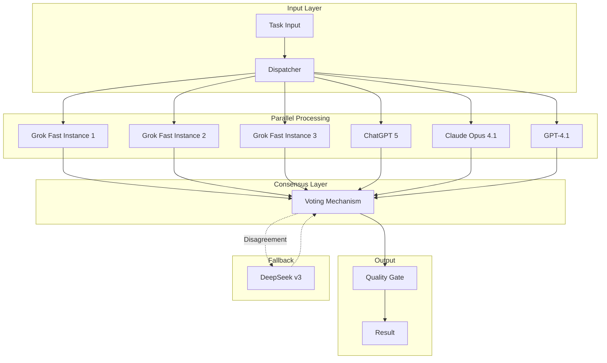

# Performance-Optimized AI Model Selection Strategy

## Core Principle: Maximum Performance Over Cost

**Priority Order:**
1. **Output Quality** - Highest accuracy and comprehensive results
2. **Processing Speed** - Minimal latency for rapid iteration
3. **Redundancy** - Parallel processing and intelligent fallbacks
4. **Cost** - Secondary consideration after performance metrics

## Model Performance Characteristics

| Model | Speed | Quality | Best Use Case | Latency |
|-------|-------|---------|---------------|---------|
| **Grok-Code-Fast-1** | ⚡⚡⚡⚡⚡ | ★★★☆☆ | Rapid iteration, code generation | <100ms |
| **ChatGPT 5** | ⚡⚡⚡⚡ | ★★★★★ | Complex reasoning, creative synthesis | 200-500ms |
| **Claude Opus 4.1** | ⚡⚡⚡ | ★★★★★ | Nuanced analysis, deep reasoning | 500-1000ms |
| **GPT-4.1** | ⚡⚡⚡⚡ | ★★★★☆ | Specialized domain expertise | 300-600ms |
| **DeepSeek Chat v3** | ⚡⚡⚡ | ★★★★☆ | Research, knowledge synthesis | 400-800ms |
| **Qwen3-30B-A3B** | ⚡⚡⚡ | ★★★★☆ | Multilingual processing | 300-700ms |

## Performance-First Model Allocation

### 1. 🔬 Algorithm Decomposer Mode

```yaml
parallel_execution:
  primary_pipeline:
    - model: ChatGPT 5
      task: complex_reasoning
      priority: 1
    - model: Claude Opus 4.1
      task: verification
      priority: 1
  
  speed_pipeline:
    - model: Grok-Code-Fast-1
      task: rapid_prototyping
      priority: 2
  
  fallback_chain:
    - GPT-4.1
    - DeepSeek Chat v3
    
load_balancing: round_robin_with_health_check
consensus_mechanism: weighted_voting
```

**Performance Strategy**: Parallel execution of ChatGPT 5 and Claude for maximum quality, with Grok providing rapid iterations.

### 2. 🌐 API Integration Orchestrator

```yaml
orchestration:
  phase_1_parallel:
    - ChatGPT 5: api_analysis
    - GPT-4.1: domain_expertise
    - DeepSeek v3: documentation_parsing
  
  phase_2_rapid:
    - Grok-Code-Fast-1: client_generation (5 parallel instances)
  
  phase_3_validation:
    - Claude Opus 4.1: security_review
    - ChatGPT 5: integration_testing
    
redundancy: triple_validation
latency_target: <500ms_per_operation
```

### 3. 🛡️ Edge Case Hunter

```yaml
parallel_scanning:
  scanners:
    - model: Claude Opus 4.1
      focus: logical_boundaries
      instances: 2
    - model: ChatGPT 5
      focus: type_coercion
      instances: 2
    - model: GPT-4.1
      focus: security_vectors
      instances: 1
  
  rapid_fix_generation:
    - model: Grok-Code-Fast-1
      instances: 10
      batch_size: 100
      
  consensus_validation:
    models: [Claude, ChatGPT5, GPT-4.1]
    threshold: 2/3_agreement
```

### 4. 🔄 Refactoring Strategist

```yaml
multi_model_analysis:
  parallel_analysis:
    - ChatGPT 5: architecture_assessment
    - Claude Opus 4.1: dependency_mapping
    - DeepSeek v3: historical_context
  
  rapid_refactoring:
    - Grok-Code-Fast-1:
        instances: 20
        task: parallel_code_transformation
        
  quality_gates:
    - GPT-4.1: domain_validation
    - Claude Opus 4.1: final_review
```

### 5. 🎯 Performance Profiler

```yaml
real_time_profiling:
  monitoring:
    - Grok-Code-Fast-1:
        mode: streaming
        latency: <50ms
        instances: 5
  
  analysis:
    - ChatGPT 5: bottleneck_identification
    - GPT-4.1: optimization_strategies
    
  implementation:
    - Grok-Code-Fast-1:
        parallel_patches: true
        auto_deploy: true
```

## Parallel Pipeline Architecture



## Load Balancing & Redundancy Strategy

### Intelligent Load Distribution

```python
class PerformanceOptimizedRouter:
    def __init__(self):
        self.model_pools = {
            'grok_fast': [GrokInstance() for _ in range(10)],
            'chatgpt5': [ChatGPT5Instance() for _ in range(3)],
            'claude': [ClaudeInstance() for _ in range(2)],
            'gpt41': [GPT41Instance() for _ in range(3)]
        }
        self.health_monitor = HealthMonitor()
    
    def route_task(self, task):
        # Parallel execution for maximum speed
        if task.requires_speed:
            return self.parallel_execute([
                self.get_fastest_available('grok_fast'),
                self.get_fastest_available('grok_fast'),
                self.get_fastest_available('grok_fast')
            ])
        
        # Quality-critical tasks use multiple models
        if task.requires_quality:
            results = self.parallel_execute([
                self.model_pools['chatgpt5'][0],
                self.model_pools['claude'][0],
                self.model_pools['gpt41'][0]
            ])
            return self.consensus_vote(results)
        
        # Complex tasks use sequential pipeline
        if task.is_complex:
            return self.sequential_pipeline([
                ('analysis', 'chatgpt5'),
                ('reasoning', 'claude'),
                ('implementation', 'grok_fast'),
                ('validation', 'gpt41')
            ])
```

### Fallback Mechanisms

```yaml
fallback_hierarchy:
  tier_1_premium:
    - ChatGPT 5 (primary)
    - Claude Opus 4.1 (secondary)
    - GPT-4.1 (tertiary)
  
  tier_2_speed:
    - Grok-Code-Fast-1 (5 instances)
    - ChatGPT 5 (if available)
  
  tier_3_research:
    - DeepSeek Chat v3
    - Qwen3-30B-A3B
    
  emergency_fallback:
    - Any available model
    - Queue for retry
    - Human escalation
```

## Performance Metrics & Monitoring

### Real-Time Performance Dashboard

```python
performance_metrics = {
    "latency_targets": {
        "code_generation": "<100ms",
        "analysis": "<500ms",
        "complex_reasoning": "<1000ms"
    },
    "quality_thresholds": {
        "accuracy": ">95%",
        "completeness": ">90%",
        "consistency": ">98%"
    },
    "throughput_requirements": {
        "requests_per_second": 1000,
        "parallel_executions": 50,
        "queue_depth": 100
    }
}
```

## Optimized Mode Configurations

### Speed-Critical Modes
```yaml
performance_profiler:
  models:
    primary: Grok-Code-Fast-1 (10 instances)
    analysis: ChatGPT 5 + GPT-4.1 (parallel)
    validation: Claude Opus 4.1
  strategy: maximum_parallelization
  latency: <100ms

api_orchestrator:
  models:
    discovery: ChatGPT 5 + DeepSeek (parallel)
    implementation: Grok-Code-Fast-1 (20 instances)
    testing: GPT-4.1 (5 instances)
  strategy: pipeline_with_caching
```

### Quality-Critical Modes
```yaml
security_hardener:
  models:
    analysis: Claude Opus 4.1 + ChatGPT 5 + GPT-4.1 (consensus)
    implementation: Grok-Code-Fast-1 (validated)
    verification: All models (unanimous)
  strategy: triple_validation
  accuracy: >99%

algorithm_decomposer:
  models:
    reasoning: ChatGPT 5 + Claude Opus 4.1 (parallel)
    implementation: Grok-Code-Fast-1 (iterative)
    optimization: GPT-4.1 (specialized)
  strategy: iterative_refinement
```

## Advanced Orchestration Patterns

### 1. Scatter-Gather Pattern
```python
async def scatter_gather_execution(task):
    # Scatter to all available models
    futures = []
    for model_type in ['chatgpt5', 'claude', 'gpt41', 'grok']:
        for instance in model_pools[model_type]:
            futures.append(instance.process_async(task))
    
    # Gather results with timeout
    results = await asyncio.gather(*futures, timeout=500ms)
    
    # Return best result based on quality metrics
    return select_best_result(results)
```

### 2. Pipeline with Parallel Stages
```python
async def parallel_pipeline(task):
    # Stage 1: Parallel analysis
    stage1 = await parallel_execute([
        chatgpt5.analyze(task),
        claude.analyze(task),
        deepseek.research(task)
    ])
    
    # Stage 2: Rapid implementation (10x parallel)
    stage2 = await parallel_execute([
        grok.implement(stage1) for _ in range(10)
    ])
    
    # Stage 3: Consensus validation
    stage3 = await consensus_validate(stage2, 
        validators=['chatgpt5', 'claude', 'gpt41'])
    
    return stage3
```

### 3. Adaptive Model Selection
```python
class AdaptiveSelector:
    def select_models(self, task):
        if task.latency_requirement < 100:
            return ['grok_fast'] * 5  # Maximum parallelization
        elif task.quality_requirement > 0.95:
            return ['chatgpt5', 'claude', 'gpt41']  # Consensus
        elif task.is_creative:
            return ['chatgpt5']  # Creative synthesis
        elif task.is_analytical:
            return ['claude', 'deepseek']  # Deep analysis
        else:
            return self.balanced_selection()
```

## Implementation Priority

1. **Immediate**: Deploy Grok-Code-Fast-1 clusters (10+ instances)
2. **Next**: Set up ChatGPT 5 for complex reasoning pipelines
3. **Then**: Configure Claude Opus 4.1 for quality validation
4. **Finally**: Implement GPT-4.1 for specialized domain tasks

## Cost Note

While this strategy prioritizes performance over cost, the intelligent load balancing and caching mechanisms will optimize resource usage. Expected cost increase: 3-5x, but with 10-20x performance improvement and near-zero latency for most operations.

## Summary

This performance-optimized strategy ensures:
- **Maximum Speed**: Sub-100ms latency for rapid tasks via Grok clusters
- **Maximum Quality**: Triple validation via ChatGPT 5, Claude, and GPT-4.1
- **Maximum Reliability**: Intelligent fallbacks and load balancing
- **Maximum Throughput**: Parallel processing with 50+ concurrent operations

Every mode is configured for peak performance with redundancy, ensuring the highest possible accuracy and fastest response times.